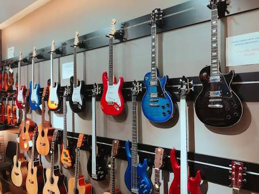
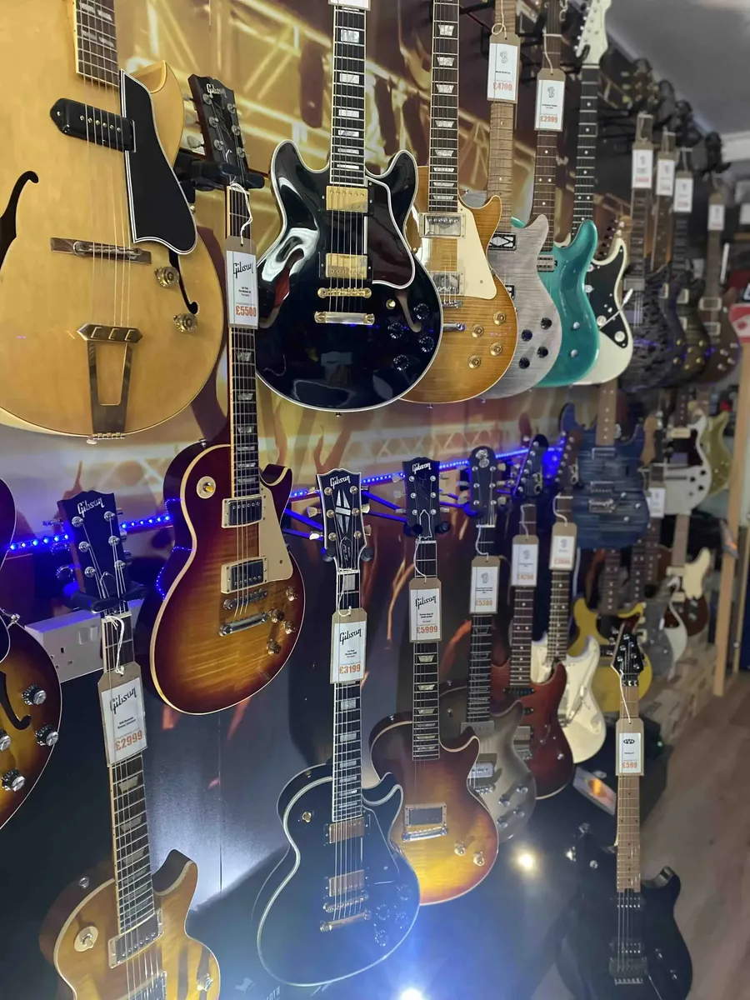

## about.php

```php
<?php
require_once __DIR__ . '/includes/config.php';
require_once __DIR__ . '/includes/products.php';

$pageTitle = 'More About Us';
$activeNav = 'about';
require __DIR__ . '/includes/header.php';
?>

<!-- ABOUT HERO  -->
<section class="about-hero">
  <div class="about-hero-inner">
    <p class="eyebrow">More about us</p>
    <h1>The Story Behind<br><em>Shan's Guitar</em></h1>
    <p class="about-hero-text">
      What started as one musician's search for the perfect acoustic has become
      a home for every player in the Philippines who cares about tone, honesty,
      and craft.
    </p>
  </div>
</section>

<!--  FOUNDING STORY  -->
<section class="about-story section-pad reveal">
  <div class="about-grid">
    <div class="about-copy">
      <p class="eyebrow">Est. 2026</p>
      <h2>It began with <em>one guitar</em></h2>
      <p>
        Our founder spent months hunting for an acoustic that felt right — and kept
        being disappointed by shops that stocked instruments they didn't understand.
        So instead of settling, we opened our own.
      </p>
      <p>
        Shan's Guitar started as a single workbench in Dumaguete City. The promise
        was simple: never sell an instrument we wouldn't proudly play ourselves.
        That promise still hangs above the door today.
      </p>
      <p>
        Every guitar on our floor is unboxed, inspected, set up, and played by our
        team before it ever reaches a customer. If it doesn't make us want to write
        a song, it doesn't go on the wall.
      </p>
    </div>
    <div class="about-image">
      
    </div>
  </div>
</section>

<!-- VALUES  -->
<section class="values section-pad reveal">
  <div class="section-heading">
    <div>
      <p class="eyebrow">What we stand for</p>
      <h2>Our <em>Values</em></h2>
    </div>
  </div>

  <div class="values-grid">
    <article class="value-card">
      <h3>We only sell guitars</h3>
      <p>No keyboards, no drum kits, no compromises. Focus lets us know our instruments — and our craft — deeper than anyone else.</p>
    </article>
    <article class="value-card">
      <h3>Every guitar is set up</h3>
      <p>String height, intonation, fret polish. Each instrument gets a professional setup before it's sold, not just a box off a shelf.</p>
    </article>
    <article class="value-card">
      <h3>Honest advice, always</h3>
      <p>We'd rather sell you the cheaper guitar that fits your hands than the expensive one that doesn't. Your next guitar should feel right.</p>
    </article>
    <article class="value-card">
      <h3>For players, by players</h3>
      <p>Our team gigs, records, and rehearses. When we recommend something, it's because we'd reach for it ourselves.</p>
    </article>
  </div>
</section>

<!--  TIMELINE  -->
<section class="timeline section-pad reveal">
  <div class="section-heading">
    <div>
      <p class="eyebrow">How we got here</p>
      <h2>Our <em>Journey</em></h2>
    </div>
  </div>

  <ol class="timeline-list">
    <li><span class="tl-year">2024</span><p>The hunt for a perfect acoustic — and the frustration that sparked the idea.</p></li>
    <li><span class="tl-year">2025</span><p>A single workbench in Dumaguete, setting up guitars for friends and local players.</p></li>
    <li><span class="tl-year">2026</span><p>Shan's Guitar opens its doors as an authorised dealer for eight of the world's finest brands.</p></li>
    <li><span class="tl-year">Today</span><p>Serving musicians across the Philippines — online and in store — one great guitar at a time.</p></li>
  </ol>
</section>

<!--  CTA  -->
<section class="about-cta reveal">
  <div class="about-cta-inner">
    <h2>Come find <em>your sound</em></h2>
    <p>Visit us in Dumaguete City, or browse the full catalogue online.</p>
    <div class="about-cta-actions">
      <a class="btn btn-gold" href="shop.php">SHOP GUITARS</a>
      <a class="btn btn-outline-dark" href="index.php#contact">CONTACT US</a>
    </div>
  </div>
</section>

<?php require __DIR__ . '/includes/footer.php'; ?>

```

## account.php

```php
<?php
require_once __DIR__ . '/includes/config.php';
require_once __DIR__ . '/includes/products.php';

require_login();
 $user = current_user();
 $pdo  = db();

/* ---- handle profile update (EDIT PROFILE form) ---- */
 $errors = [];
if ($_SERVER['REQUEST_METHOD'] === 'POST') {
    csrf_check();

    $name  = trim($_POST['name']  ?? '');
    $email = trim($_POST['email'] ?? '');
    $phone = trim($_POST['phone'] ?? '');

    if ($name === '')                                   $errors[] = 'Please enter your full name.';
    if (!filter_var($email, FILTER_VALIDATE_EMAIL))     $errors[] = 'Please enter a valid email address.';
    if ($phone !== '' && !preg_match('/^[0-9+()\-\s]{7,20}$/', $phone))
                                                        $errors[] = 'Please enter a valid phone number.';

    /* email must not belong to a different account */
    if (!$errors && $pdo) {
        $st = $pdo->prepare('SELECT id FROM users WHERE email = ? AND id <> ?');
        $st->execute([$email, $user['id']]);
        if ($st->fetch()) $errors[] = 'That email is already used by another account.';
    }

    if (!$errors && $pdo) {
        $st = $pdo->prepare('UPDATE users SET name = ?, email = ?, phone = ? WHERE id = ?');
        $st->execute([$name, $email, $phone, $user['id']]);

        $_SESSION['user_name']  = $name;   /* keep the header in sync */
        $_SESSION['user_email'] = $email;

        flash('success', 'Profile updated.');
        redirect('account.php');
    }
}

/* ---- fresh profile data from the users table ---- */
 $profile = ['name' => $user['name'], 'email' => $user['email'], 'phone' => '', 'created_at' => null];
if ($pdo) {
    $st = $pdo->prepare('SELECT name, email, phone, created_at FROM users WHERE id = ?');
    $st->execute([$user['id']]);
    if ($row = $st->fetch()) $profile = array_merge($profile, $row);
}

/* form prefill: submitted values when there are errors, otherwise DB values */
 $formVals = $errors ? array_merge($profile, $_POST) : $profile;

/* ---- avatar initials ---- */
 $initials = '';
foreach (preg_split('/\s+/', trim($profile['name'])) as $w) {
    if ($w !== '') $initials .= mb_strtoupper(mb_substr($w, 0, 1));
    if (mb_strlen($initials) >= 2) break;
}
if ($initials === '') $initials = 'SG';

/* ---- orders + stats ---- */
 $orders = [];
 $stats  = ['orders' => 0, 'spent' => 0.0, 'items' => 0];
if ($pdo) {
    $stmt = $pdo->prepare('SELECT * FROM orders WHERE user_id = ? ORDER BY created_at DESC');
    $stmt->execute([$user['id']]);
    $orders = $stmt->fetchAll();

    foreach ($orders as $o) {
        if (($o['status'] ?? '') === 'cancelled') continue;
        $stats['orders']++;
        $stats['spent'] += (float)$o['total'];
        foreach (json_decode($o['items'], true) ?: [] as $it) {
            $stats['items'] += (int)($it['qty'] ?? 0);
        }
    }
}

 $memberSince = $profile['created_at'] ? date('F j, Y', strtotime($profile['created_at'])) : null;

 $pageTitle = 'My Account';
 $activeNav = '';
require __DIR__ . '/includes/header.php';
?>

<section class="account-page section-pad">

  <!-- ============ PROFILE HERO ============ -->
  <div class="profile-hero reveal">
    <div class="profile-id">
      <div class="avatar" aria-hidden="true"><?= e($initials) ?></div>
      <div>
        <p class="eyebrow">My account</p>
        <h2><?= e($profile['name']) ?></h2>
        <p class="profile-email"><?= e($profile['email']) ?></p>
        <div class="profile-badges">
          <?php if ($memberSince): ?>
            <span class="pill-badge gold">Member since <?= e(date('M Y', strtotime($profile['created_at']))) ?></span>
          <?php endif; ?>
          <span class="pill-badge">● Active</span>
        </div>
      </div>
    </div>

    <div class="profile-hero-actions">
      <a class="btn btn-gold" href="shop.php">CONTINUE SHOPPING</a>
      <a class="btn btn-outline" href="cart.php">VIEW CART (<?= cart_count() ?>)</a>
    </div>
  </div>

  <!-- ============ STATS ============ -->
  <div class="profile-stats reveal">
    <div class="stat-card">
      <div class="stat-num"><?= (int)$stats['orders'] ?></div>
      <div class="stat-label">Orders placed</div>
    </div>
    <div class="stat-card">
      <div class="stat-num"><?= peso($stats['spent']) ?></div>
      <div class="stat-label">Total spent</div>
    </div>
    <div class="stat-card">
      <div class="stat-num"><?= (int)$stats['items'] ?></div>
      <div class="stat-label">Items purchased</div>
    </div>
    <div class="stat-card">
      <div class="stat-num"><?= cart_count() ?></div>
      <div class="stat-label">In cart now</div>
    </div>
  </div>

  <div class="account-layout">
    <aside class="account-nav">
      <h4>MY ACCOUNT</h4>
      <a href="#profile" class="active">Profile details</a>
      <a href="#orders">Order history</a>
      <a href="cart.php">Your cart</a>
      <a href="logout.php" class="danger">Log out</a>
    </aside>

    <div class="account-main">

      <!-- ============ PROFILE DETAILS ============ -->
      <section id="profile" class="profile-card reveal">
        <header class="profile-card-head">
          <h3>Account information</h3>
          <details class="edit-details" <?= $errors ? 'open' : '' ?>>
            <summary class="btn btn-outline-dark">
              <span class="when-closed">EDIT PROFILE</span>
              <span class="when-open">CLOSE</span>
            </summary>
          </details>
        </header>

        <?php if ($errors): ?>
          <ul class="form-errors" style="margin:20px 24px 0">
            <?php foreach ($errors as $err): ?><li><?= e($err) ?></li><?php endforeach; ?>
          </ul>
        <?php endif; ?>

        <dl class="info-grid">
          <div class="info-item">
            <dt>Full name</dt>
            <dd><?= e($profile['name']) ?></dd>
          </div>
          <div class="info-item">
            <dt>Email</dt>
            <dd><?= e($profile['email']) ?></dd>
          </div>
          <div class="info-item">
            <dt>Phone</dt>
            <dd><?= $profile['phone'] !== '' ? e($profile['phone']) : '—' ?><small><?= $profile['phone'] !== '' ? '' : 'Not provided yet' ?></small></dd>
          </div>
          <div class="info-item">
            <dt>Member since</dt>
            <dd><?= $memberSince ? e($memberSince) : '—' ?></dd>
          </div>
        </dl>

        <!-- edit form (opens via the details toggle, no JS needed) -->
        <form class="checkout-form profile-edit-form" method="post" action="account.php">
          <?= csrf_field() ?>
          <div class="form-grid">
            <label>Full name
              <input type="text" name="name" maxlength="120" required value="<?= e($formVals['name']) ?>">
            </label>
            <label>Email
              <input type="email" name="email" maxlength="190" required value="<?= e($formVals['email']) ?>">
            </label>
            <label>Phone <span style="opacity:.55;font-weight:400">(optional)</span>
              <input type="tel" name="phone" maxlength="40" placeholder="0917 123 4567" value="<?= e($formVals['phone']) ?>">
            </label>
          </div>
          <button class="btn btn-gold" type="submit" style="margin-top:18px">SAVE CHANGES</button>
        </form>
      </section>

      <!-- ============ ORDER HISTORY ============ -->
      <section id="orders">
        <h3 style="margin-bottom:20px;font-size:1.5rem">Order history</h3>

        <?php if (!$pdo): ?>
          <div class="empty-state">
            <h3>Database not connected</h3>
            <p>Check your MySQL settings in <code>includes/config.php</code> and run <code>install.php</code> once.</p>
          </div>

        <?php elseif (!$orders): ?>
          <div class="empty-state">
            <h3>No orders yet</h3>
            <p>When you check out, your orders will appear here.</p>
            <a class="btn btn-gold" href="shop.php" style="margin-top:22px">START SHOPPING</a>
          </div>

        <?php else: ?>
          <div class="orders-list">
            <?php foreach ($orders as $o): ?>
              <?php
                $items  = json_decode($o['items'], true) ?: [];
                $status = ucfirst($o['status']);
              ?>
              <article class="order-card">
                <div class="order-head">
                  <div>
                    <strong>Order #<?= (int)$o['id'] ?></strong>
                    <span class="order-date"><?= date('M j, Y · g:i A', strtotime($o['created_at'])) ?></span>
                  </div>
                  <span class="order-status status-<?= e($o['status']) ?>"><?= e($status) ?></span>
                </div>
                <div class="order-body">
                  <ul class="order-items">
                    <?php foreach ($items as $it): ?>
                      <li>
                        <span><?= e($it['name']) ?> × <?= (int)$it['qty'] ?></span>
                        <strong><?= peso($it['price'] * $it['qty']) ?></strong>
                      </li>
                    <?php endforeach; ?>
                  </ul>
                  <div class="order-total">Total: <strong><?= peso($o['total']) ?></strong></div>
                  <p class="order-detail"><strong>Fulfillment:</strong> <?= e($o['fulfillment']) ?> ·
                     <strong>Address:</strong> <?= e($o['address']) ?>, <?= e($o['city']) ?></p>
                </div>
              </article>
            <?php endforeach; ?>
          </div>
        <?php endif; ?>
      </section>

    </div>
  </div>
</section>

<?php require __DIR__ . '/includes/footer.php'; ?>
```

## admin.php

```php
<?php
require_once __DIR__ . '/includes/config.php';

/* ============================================================
   SHAN'S GUITAR — Admin Panel
   Self-contained: own auth (admins table), own layout/CSS.
   Reuses config.php's db(), e(), peso(), csrf_field(), csrf_check(),
   flash(), take_flash(), redirect() helpers.
   Adapted to match the actual database schema:
   orders (user_id, items, total, fulfillment, fullname,
   phone, address, city, notes, status) + users + guitars + admins.
   ============================================================ */

define('LOW_STOCK_THRESHOLD', 3);
define('UPLOAD_DIR',  __DIR__ . '/uploads/guitars/');
define('UPLOAD_PATH', 'uploads/guitars/');

/* ---------- ADMIN AUTH ---------- */
function admin_logged_in(): bool { return !empty($_SESSION['admin_id']); }

function current_admin(): ?array {
    if (!admin_logged_in()) return null;
    return [
        'id'    => (int)$_SESSION['admin_id'],
        'name'  => $_SESSION['admin_name']  ?? 'Admin',
        'email' => $_SESSION['admin_email'] ?? '',
    ];
}

function admin_initial(string $name): string {
    $name = trim($name);
    if ($name === '') return 'A';
    return function_exists('mb_strtoupper')
        ? mb_strtoupper(mb_substr($name, 0, 1))
        : strtoupper(substr($name, 0, 1));
}

/* ---------- SMALL HELPERS ---------- */
function db_or_die(): PDO {
    $pdo = db();
    if (!$pdo) {
        http_response_code(500);
        exit('Database connection failed. Check includes/config.php and that the admin_schema.sql tables exist.');
    }
    return $pdo;
}

function stock_class(int $stock): string {
    if ($stock <= 0) return 'stock-out';
    if ($stock <= LOW_STOCK_THRESHOLD) return 'stock-low';
    return 'stock-ok';
}

function stock_label(int $stock): string {
    if ($stock <= 0) return 'Out of stock';
    if ($stock <= LOW_STOCK_THRESHOLD) return $stock . ' left · Low';
    return $stock . ' in stock';
}

function handle_image_upload(?array $file): ?string {
    if (empty($file) || $file['error'] === UPLOAD_ERR_NO_FILE) return null;
    if ($file['error'] !== UPLOAD_ERR_OK) return null;
    $allowed = ['jpg' => true, 'jpeg' => true, 'png' => true, 'webp' => true];
    $ext = strtolower(pathinfo($file['name'], PATHINFO_EXTENSION));
    if (!isset($allowed[$ext])) return null;
    if ($file['size'] > 4 * 1024 * 1024) return null;
    if (!is_dir(UPLOAD_DIR)) @mkdir(UPLOAD_DIR, 0755, true);
    $filename = 'gtr_' . bin2hex(random_bytes(6)) . '.' . $ext;
    if (!move_uploaded_file($file['tmp_name'], UPLOAD_DIR . $filename)) return null;
    return UPLOAD_PATH . $filename;
}

/* ---------- ORDER ITEMS PARSER ----------
   Your checkout saves the cart as text in orders.items.
   Understands the common formats (JSON product list,
   JSON id => qty map, PHP serialize) with a raw fallback. */
function order_items_from_text(PDO $pdo, ?string $itemsText): array {
    $text = trim((string)$itemsText);
    if ($text === '') return [];

    $data = json_decode($text, true);
    if (!is_array($data) && $text[0] === 'a') {
        $data = @unserialize($text, ['allowed_classes' => false]);
    }
    if (!is_array($data) || $data === []) {
        return [['name' => $text, 'gid' => null, 'qty' => 1, 'price' => null]];
    }

    $rows = [];
    $needIds = [];

    foreach ($data as $key => $val) {
        if (is_string($val)) { // simple list of names
            $rows[] = ['name' => $val, 'gid' => null, 'qty' => 1, 'price' => null];
            continue;
        }
        $it  = is_array($val) || is_object($val) ? (array)$val : [];
        $qty = (int)($it['qty'] ?? $it['quantity'] ?? (is_scalar($val) ? $val : 1));
        $row = [
            'name'  => $it['name'] ?? $it['guitar_name'] ?? $it['title'] ?? null,
            'gid'   => null,
            'qty'   => max(1, $qty),
            'price' => isset($it['price']) ? (float)$it['price'] : null,
        ];
        if ($row['name'] === null) {
            $gid = (int)($it['id'] ?? $it['guitar_id'] ?? $key);
            if ($gid > 0) { $row['gid'] = $gid; $needIds[$gid] = true; }
            else { $row['name'] = 'Item'; }
        }
        $rows[] = $row;
    }

    /* Look up names/prices for rows that only stored a guitar id */
    if ($needIds) {
        $ids = array_keys($needIds);
        $in  = implode(',', array_fill(0, count($ids), '?'));
        $stmt = $pdo->prepare("SELECT id, name, price FROM guitars WHERE id IN ($in)");
        $stmt->execute($ids);
        $guitars = [];
        foreach ($stmt->fetchAll() as $g) $guitars[(int)$g['id']] = $g;

        foreach ($rows as &$row) {
            if ($row['name'] === null && $row['gid'] !== null) {
                $g = $guitars[$row['gid']] ?? null;
                $row['name'] = $g['name'] ?? ('Guitar #' . $row['gid']);
                if ($row['price'] === null) $row['price'] = $g['price'] ?? null;
            }
            unset($row['gid']);
        }
        unset($row);
    }

    return $rows;
}

 $pdo = db_or_die();

/* ============================================================
   HANDLE POST ACTIONS (before any output, so redirect() can fire)
   ============================================================ */
if ($_SERVER['REQUEST_METHOD'] === 'POST') {
    $action = $_POST['action'] ?? '';

    /* ---- Admin login ---- */
    if ($action === 'admin_login') {
        csrf_check();
        $email = trim($_POST['email'] ?? '');
        $pass  = $_POST['password'] ?? '';
        $stmt = $pdo->prepare('SELECT * FROM admins WHERE email = ?');
        $stmt->execute([$email]);
        $adminRow = $stmt->fetch();
        if ($adminRow && password_verify($pass, $adminRow['password'])) {
            session_regenerate_id(true);
            $_SESSION['admin_id']    = (int)$adminRow['id'];
            $_SESSION['admin_name']  = $adminRow['name'];
            $_SESSION['admin_email'] = $adminRow['email'];
            flash('success', 'Welcome back, ' . explode(' ', $adminRow['name'])[0] . '!');
            redirect('admin.php');
        }
        flash('error', 'Incorrect email or password.');
        redirect('admin.php');
    }

    /* Everything below requires an authenticated admin */
    if (!admin_logged_in()) redirect('admin.php');

    /* ---- Logout ---- */
    if ($action === 'admin_logout') {
        csrf_check();
        unset($_SESSION['admin_id'], $_SESSION['admin_name'], $_SESSION['admin_email']);
        flash('info', "You've been logged out.");
        redirect('admin.php');
    }

    /* ---- Add / edit guitar ---- */
    if ($action === 'save_guitar') {
        csrf_check();
        $id          = (int)($_POST['guitar_id'] ?? 0);
        $name        = trim($_POST['name'] ?? '');
        $brand       = trim($_POST['brand'] ?? '');
        $category    = trim($_POST['category'] ?? 'Acoustic');
        $price       = (float)($_POST['price'] ?? 0);
        $stock       = max(0, (int)($_POST['stock'] ?? 0));
        $description = trim($_POST['description'] ?? '');
        $bestseller  = isset($_POST['is_bestseller']) ? 1 : 0;
        $imageUrl    = trim($_POST['image_url'] ?? '');

        if ($name === '') {
            flash('error', 'Guitar name is required.');
            redirect('admin.php?tab=guitars');
        }

        $uploaded = handle_image_upload($_FILES['image'] ?? null);
        $image = $uploaded !== null ? $uploaded : $imageUrl;

        if ($id > 0) {
            if ($image === '') {
                $stmt = $pdo->prepare('SELECT image FROM guitars WHERE id = ?');
                $stmt->execute([$id]);
                $image = (string)$stmt->fetchColumn();
            }
            $stmt = $pdo->prepare('UPDATE guitars SET name=?, brand=?, category=?, price=?, stock=?, image=?, description=?, is_bestseller=? WHERE id=?');
            $stmt->execute([$name, $brand, $category, $price, $stock, $image, $description, $bestseller, $id]);
            flash('success', '"' . $name . '" was updated.');
        } else {
            $stmt = $pdo->prepare('INSERT INTO guitars (name, brand, category, price, stock, image, description, is_bestseller) VALUES (?,?,?,?,?,?,?,?)');
            $stmt->execute([$name, $brand, $category, $price, $stock, $image, $description, $bestseller]);
            flash('success', '"' . $name . '" was added.');
        }
        redirect('admin.php?tab=guitars');
    }

    /* ---- Delete guitar ---- */
    if ($action === 'delete_guitar') {
        csrf_check();
        $id = (int)($_POST['guitar_id'] ?? 0);
        $stmt = $pdo->prepare('DELETE FROM guitars WHERE id = ?');
        $stmt->execute([$id]);
        flash('success', 'Guitar removed.');
        redirect('admin.php?tab=guitars');
    }

    /* ---- Adjust stock (+ / -) ---- */
    if ($action === 'adjust_stock') {
        csrf_check();
        $id    = (int)($_POST['guitar_id'] ?? 0);
        $delta = (int)($_POST['delta'] ?? 0);
        $stmt = $pdo->prepare('UPDATE guitars SET stock = GREATEST(0, stock + ?) WHERE id = ?');
        $stmt->execute([$delta, $id]);
        $qs = !empty($_POST['q']) ? '&q=' . urlencode($_POST['q']) : '';
        redirect('admin.php?tab=guitars' . $qs);
    }

    /* ---- Update order status (also used by Accept / Reject buttons) ---- */
    if ($action === 'update_order_status') {
        csrf_check();
        $id     = (int)($_POST['order_id'] ?? 0);
        $status = $_POST['status'] ?? '';
        $allowedStatus = ['pending', 'confirmed', 'shipped', 'delivered', 'cancelled'];
        if (in_array($status, $allowedStatus, true)) {
            $stmt = $pdo->prepare('UPDATE orders SET status = ? WHERE id = ?');
            $stmt->execute([$status, $id]);
            if ($status === 'confirmed') {
                flash('success', 'Order #' . $id . ' accepted ✔ — marked Confirmed.');
            } elseif ($status === 'cancelled') {
                flash('error', 'Order #' . $id . ' rejected ✖ — marked Cancelled.');
            } else {
                flash('success', 'Order #' . $id . ' marked ' . ucfirst($status) . '.');
            }
        }
        redirect('admin.php?tab=orders');
    }

    /* ---- Change admin password ---- */
    if ($action === 'change_password') {
        csrf_check();
        $current = $_POST['current_password'] ?? '';
        $new     = $_POST['new_password'] ?? '';
        $adminId = (int)$_SESSION['admin_id'];
        $stmt = $pdo->prepare('SELECT * FROM admins WHERE id = ?');
        $stmt->execute([$adminId]);
        $adminRow = $stmt->fetch();
        if (!$adminRow || !password_verify($current, $adminRow['password'])) {
            flash('error', 'Current password is incorrect.');
        } elseif (strlen($new) < 8) {
            flash('error', 'New password must be at least 8 characters.');
        } else {
            $hash = password_hash($new, PASSWORD_DEFAULT);
            $stmt = $pdo->prepare('UPDATE admins SET password = ? WHERE id = ?');
            $stmt->execute([$hash, $adminId]);
            flash('success', 'Password updated.');
        }
        redirect('admin.php?tab=settings');
    }
}

/* ============================================================
   GATE: show login screen if not authenticated
   ============================================================ */
if (!admin_logged_in()) {
    $flash = take_flash();
    ?>
    <!DOCTYPE html>
    <html lang="en">
    <head>
    <meta charset="UTF-8">
    <meta name="viewport" content="width=device-width, initial-scale=1">
    <title>Admin Login — Shan's Guitar</title>
    <link rel="preconnect" href="https://fonts.googleapis.com">
    <link href="https://fonts.googleapis.com/css2?family=Fraunces:ital,wght@0,600;0,700;1,500&family=Outfit:wght@400;600;700&display=swap" rel="stylesheet">
    <link rel="stylesheet" href="assets/admin.css">
    </head>
    <body class="admin-body">
      <?php if ($flash): ?>
        <div class="admin-flash flash-<?= e($flash['type']) ?>" id="adminFlash"><?= e($flash['msg']) ?></div>
      <?php endif; ?>
      <div class="admin-login-wrap">
        <div class="admin-login-card">
          <div class="admin-login-brand"><span class="dot"></span> shan's guitar</div>
          <p class="eyebrow">Staff Only</p>
          <h1>Admin Login</h1>
          <p class="admin-login-sub">Sign in to manage inventory and orders.</p>
          <form method="post" class="admin-form" action="admin.php">
            <?= csrf_field() ?>
            <input type="hidden" name="action" value="admin_login">
            <label>Email address
              <input type="email" name="email" placeholder="admin@shansguitar.com" required autofocus>
            </label>
            <label>Password
              <input type="password" name="password" placeholder="••••••••" required>
            </label>
            <button class="btn btn-gold full" type="submit">LOG IN</button>
          </form>
          <div class="admin-login-note">This area is restricted to Shan's Guitar staff. Customers should head back to the <a href="index.php" style="color:var(--gold); font-weight:700;">shop</a>.</div>
        </div>
      </div>
      <script>
        const f = document.getElementById('adminFlash');
        if (f) setTimeout(() => f.remove(), 3500);
      </script>
    </body>
    </html>
    <?php
    exit;
}

/* ============================================================
   AUTHENTICATED — GATHER DATA FOR THE CURRENT TAB
   ============================================================ */
 $admin = current_admin();
 $flash = take_flash();
 $tab   = $_GET['tab'] ?? 'dashboard';
 $allowedTabs = ['dashboard', 'guitars', 'orders', 'settings'];
if (!in_array($tab, $allowedTabs, true)) $tab = 'dashboard';

/* dashboard stats (cheap — small tables, fine to always compute for the sidebar badge) */
 $stats = [
    'guitars'     => (int)$pdo->query('SELECT COUNT(*) FROM guitars')->fetchColumn(),
    'stock_units' => (int)$pdo->query('SELECT COALESCE(SUM(stock),0) FROM guitars')->fetchColumn(),
    'low_stock'   => (int)$pdo->query('SELECT COUNT(*) FROM guitars WHERE stock <= ' . LOW_STOCK_THRESHOLD)->fetchColumn(),
    'orders'      => (int)$pdo->query('SELECT COUNT(*) FROM orders')->fetchColumn(),
    'pending'     => (int)$pdo->query("SELECT COUNT(*) FROM orders WHERE status = 'pending'")->fetchColumn(),
    'revenue'     => (float)$pdo->query("SELECT COALESCE(SUM(total),0) FROM orders WHERE status != 'cancelled'")->fetchColumn(),
];

if ($tab === 'dashboard') {
    $recentOrders = $pdo->query('SELECT * FROM orders ORDER BY created_at DESC LIMIT 6')->fetchAll();
    $lowStockList = $pdo->query('SELECT * FROM guitars WHERE stock <= ' . LOW_STOCK_THRESHOLD . ' ORDER BY stock ASC LIMIT 6')->fetchAll();
}

 $q = trim($_GET['q'] ?? '');
 $formMode = '';
 $editGuitar = null;
if ($tab === 'guitars') {
    if ($q !== '') {
        $stmt = $pdo->prepare('SELECT * FROM guitars WHERE name LIKE ? OR brand LIKE ? ORDER BY created_at DESC');
        $like = '%' . $q . '%';
        $stmt->execute([$like, $like]);
        $guitars = $stmt->fetchAll();
    } else {
        $guitars = $pdo->query('SELECT * FROM guitars ORDER BY created_at DESC')->fetchAll();
    }

    $formMode = $_GET['form'] ?? '';
    if ($formMode === 'edit' && !empty($_GET['id'])) {
        $stmt = $pdo->prepare('SELECT * FROM guitars WHERE id = ?');
        $stmt->execute([(int)$_GET['id']]);
        $editGuitar = $stmt->fetch() ?: null;
        if (!$editGuitar) $formMode = '';
    }
}

 $statusFilter = '';
if ($tab === 'orders') {
    $statusFilter = $_GET['status'] ?? '';
    $allowedStatus = ['pending', 'confirmed', 'shipped', 'delivered', 'cancelled'];
    if ($statusFilter && in_array($statusFilter, $allowedStatus, true)) {
        $stmt = $pdo->prepare('SELECT o.*, u.email AS user_email FROM orders o LEFT JOIN users u ON u.id = o.user_id WHERE o.status = ? ORDER BY o.created_at DESC');
        $stmt->execute([$statusFilter]);
        $orders = $stmt->fetchAll();
    } else {
        $statusFilter = '';
        $orders = $pdo->query('SELECT o.*, u.email AS user_email FROM orders o LEFT JOIN users u ON u.id = o.user_id ORDER BY o.created_at DESC')->fetchAll();
    }
}

 $pageTitles = [
    'dashboard' => 'Dashboard',
    'guitars'   => 'Guitars & Stock',
    'orders'    => 'Orders',
    'settings'  => 'Settings',
];
 $pageTitle = $pageTitles[$tab];
?>
<!DOCTYPE html>
<html lang="en">
<head>
<meta charset="UTF-8">
<meta name="viewport" content="width=device-width, initial-scale=1">
<title><?= e($pageTitle) ?> — Admin · Shan's Guitar</title>
<link rel="preconnect" href="https://fonts.googleapis.com">
<link href="https://fonts.googleapis.com/css2?family=Fraunces:ital,wght@0,600;0,700;1,500&family=Outfit:wght@400;600;700&display=swap" rel="stylesheet">
<link rel="stylesheet" href="assets/admin.css">
<style>
  /* Accept / Reject buttons */
  .btn-accept {
    background:#1e8e3e; color:#fff; border:0; padding:9px 22px;
    border-radius:8px; font-weight:700; font-size:.78rem; cursor:pointer;
    letter-spacing:1px; font-family:inherit; transition:background .15s;
  }
  .btn-accept:hover { background:#156a2e; }
  .btn-reject {
    background:transparent; color:#c0392b; border:1.5px solid #c0392b;
    padding:7.5px 22px; border-radius:8px; font-weight:700; font-size:.78rem;
    cursor:pointer; letter-spacing:1px; font-family:inherit; transition:all .15s;
  }
  .btn-reject:hover { background:#c0392b; color:#fff; }
</style>
</head>
<body class="admin-body">

<?php if ($flash): ?>
  <div class="admin-flash flash-<?= e($flash['type']) ?>" id="adminFlash"><?= e($flash['msg']) ?></div>
<?php endif; ?>

<div class="admin-shell">
  <aside class="admin-sidebar">
    <div class="admin-brand"><span class="dot"></span> shan's guitar<br><small style="margin-left:17px;">Admin</small></div>

    <a href="admin.php?tab=dashboard" class="admin-nav-link <?= $tab === 'dashboard' ? 'active' : '' ?>">
      <svg viewBox="0 0 24 24" fill="none" stroke="currentColor" stroke-width="2"><rect x="3" y="3" width="7" height="9" rx="1.5"/><rect x="14" y="3" width="7" height="5" rx="1.5"/><rect x="14" y="12" width="7" height="9" rx="1.5"/><rect x="3" y="16" width="7" height="5" rx="1.5"/></svg>
      Dashboard
    </a>
    <a href="admin.php?tab=guitars" class="admin-nav-link <?= $tab === 'guitars' ? 'active' : '' ?>">
      <svg viewBox="0 0 24 24" fill="none" stroke="currentColor" stroke-width="2"><path d="M21 3 10.5 13.5"/><path d="M14.5 6.5 3 18a2.1 2.1 0 0 0 3 3L17.5 9.5"/><circle cx="8.5" cy="17.5" r="2"/></svg>
      Guitars
    </a>
    <a href="admin.php?tab=orders" class="admin-nav-link <?= $tab === 'orders' ? 'active' : '' ?>">
      <svg viewBox="0 0 24 24" fill="none" stroke="currentColor" stroke-width="2"><path d="M6 3h12l1 5H5l1-5Z"/><path d="M5 8h14l-1.2 11a2 2 0 0 1-2 1.8H8.2a2 2 0 0 1-2-1.8L5 8Z"/><path d="M9 12v2M15 12v2"/></svg>
      Orders
      <?php if ($stats['pending'] > 0): ?><span style="margin-left:auto;background:var(--gold);color:#fff;font-size:.65rem;padding:2px 8px;border-radius:20px;"><?= $stats['pending'] ?></span><?php endif; ?>
    </a>
    <a href="admin.php?tab=settings" class="admin-nav-link <?= $tab === 'settings' ? 'active' : '' ?>">
      <svg viewBox="0 0 24 24" fill="none" stroke="currentColor" stroke-width="2"><circle cx="12" cy="12" r="3"/><path d="M19.4 15a1.7 1.7 0 0 0 .34 1.87l.06.06a2 2 0 1 1-2.83 2.83l-.06-.06a1.7 1.7 0 0 0-1.87-.34 1.7 1.7 0 0 0-1.04 1.56V21a2 2 0 1 1-4 0v-.09A1.7 1.7 0 0 0 9 19.37a1.7 1.7 0 0 0-1.87.34l-.06.06a2 2 0 1 1-2.83-2.83l.06-.06A1.7 1.7 0 0 0 4.64 15a1.7 1.7 0 0 0-1.56-1.04H3a2 2 0 1 1 0-4h.09A1.7 1.7 0 0 0 4.63 9a1.7 1.7 0 0 0-.34-1.87l-.06-.06a2 2 0 1 1 2.83-2.83l.06.06A1.7 1.7 0 0 0 9 4.64a1.7 1.7 0 0 0 1.04-1.56V3a2 2 0 1 1 4 0v.09a1.7 1.7 0 0 0 1.04 1.56 1.7 1.7 0 0 0 1.87-.34l.06-.06a2 2 0 1 1 2.83 2.83l-.06.06A1.7 1.7 0 0 0 19.37 9a1.7 1.7 0 0 0 1.56 1.04H21a2 2 0 1 1 0 4h-.09a1.7 1.7 0 0 0-1.51 1Z"/></svg>
      Settings
    </a>

    <div class="admin-sidebar-foot">
      <form method="post" action="admin.php">
        <?= csrf_field() ?>
        <input type="hidden" name="action" value="admin_logout">
        <button class="admin-logout" type="submit" style="width:100%; border:0; background:transparent; cursor:pointer; text-align:left;">
          <svg viewBox="0 0 24 24" fill="none" stroke="currentColor" stroke-width="2"><path d="M9 21H5a2 2 0 0 1-2-2V5a2 2 0 0 1 2-2h4"/><path d="M16 17l5-5-5-5"/><path d="M21 12H9"/></svg>
          Log out
        </button>
      </form>
    </div>
  </aside>

  <main class="admin-main">
    <div class="admin-topbar">
      <div>
        <p class="eyebrow"><?= $tab === 'dashboard' ? 'Overview' : 'Manage' ?></p>
        <h1><?= e($pageTitle) ?></h1>
      </div>
      <div class="admin-who">
        <span class="admin-avatar"><?= e(admin_initial($admin['name'])) ?></span>
        <?= e($admin['name']) ?>
      </div>
    </div>

    <?php if ($tab === 'dashboard'): ?>

      <div class="stat-grid">
        <div class="stat-card">
          <p class="stat-label">Total Guitars</p>
          <p class="stat-value"><?= $stats['guitars'] ?></p>
          <p class="stat-sub"><?= $stats['stock_units'] ?> units in stock</p>
        </div>
        <div class="stat-card">
          <p class="stat-label">Low Stock</p>
          <p class="stat-value"><?= $stats['low_stock'] ?></p>
          <p class="stat-sub">&le; <?= LOW_STOCK_THRESHOLD ?> units remaining</p>
        </div>
        <div class="stat-card">
          <p class="stat-label">Orders</p>
          <p class="stat-value"><?= $stats['orders'] ?></p>
          <p class="stat-sub"><?= $stats['pending'] ?> pending</p>
        </div>
        <div class="stat-card">
          <p class="stat-label">Revenue</p>
          <p class="stat-value"><?= peso($stats['revenue']) ?></p>
          <p class="stat-sub">All non-cancelled orders</p>
        </div>
      </div>

      <div class="panel">
        <div class="panel-head">
          <div><h2>Recent Orders</h2><p class="sub">Latest 6 orders</p></div>
          <a href="admin.php?tab=orders" class="btn btn-outline btn-sm">View all</a>
        </div>
        <div class="panel-body admin-table-wrap">
          <table class="admin-table">
            <thead><tr><th>Order</th><th>Customer</th><th>Total</th><th>Status</th><th>Date</th></tr></thead>
            <tbody>
              <?php if (!$recentOrders): ?>
                <tr class="empty-row"><td colspan="5">No orders yet.</td></tr>
              <?php else: foreach ($recentOrders as $o): ?>
                <tr>
                  <td>#<?= (int)$o['id'] ?></td>
                  <td><?= e($o['fullname'] ?? 'Guest') ?></td>
                  <td><?= peso($o['total']) ?></td>
                  <td><span class="order-status-badge status-<?= e($o['status']) ?>"><?= e(ucfirst($o['status'])) ?></span></td>
                  <td><?= e(date('M j, Y', strtotime($o['created_at']))) ?></td>
                </tr>
              <?php endforeach; endif; ?>
            </tbody>
          </table>
        </div>
      </div>

      <div class="panel">
        <div class="panel-head">
          <div><h2>Low Stock Alerts</h2><p class="sub">Guitars at or below <?= LOW_STOCK_THRESHOLD ?> units</p></div>
          <a href="admin.php?tab=guitars" class="btn btn-outline btn-sm">Manage stock</a>
        </div>
        <div class="panel-body admin-table-wrap">
          <table class="admin-table">
            <thead><tr><th>Guitar</th><th>Brand</th><th>Stock</th></tr></thead>
            <tbody>
              <?php if (!$lowStockList): ?>
                <tr class="empty-row"><td colspan="3">All good — nothing low on stock.</td></tr>
              <?php else: foreach ($lowStockList as $g): ?>
                <tr>
                  <td class="cell-product">
                    <div class="cell-thumb"><?php if ($g['image']): ?>" alt=""><?php endif; ?></div>
                    <div><strong><?= e($g['name']) ?></strong><span><?= e($g['category']) ?></span></div>
                  </td>
                  <td><?= e($g['brand']) ?></td>
                  <td><span class="stock-pill <?= stock_class((int)$g['stock']) ?>"><?= e(stock_label((int)$g['stock'])) ?></span></td>
                </tr>
              <?php endforeach; endif; ?>
            </tbody>
          </table>
        </div>
      </div>

    <?php elseif ($tab === 'guitars'): ?>

      <div class="panel">
        <div class="panel-head">
          <div><h2>All Guitars</h2><p class="sub"><?= count($guitars) ?> total</p></div>
          <div class="panel-toolbar">
            <form method="get" action="admin.php" style="display:flex; gap:8px;">
              <input type="hidden" name="tab" value="guitars">
              <input class="search-box" type="text" name="q" value="<?= e($q) ?>" placeholder="Search name or brand…">
            </form>
            <a href="admin.php?tab=guitars&form=add" class="btn btn-gold btn-sm">
              <svg viewBox="0 0 24 24" fill="none" stroke="currentColor" stroke-width="2.4"><path d="M12 5v14M5 12h14"/></svg>
              Add Guitar
            </a>
          </div>
        </div>
        <div class="panel-body admin-table-wrap">
          <table class="admin-table">
            <thead><tr><th>Guitar</th><th>Brand</th><th>Category</th><th>Price</th><th>Stock</th><th></th></tr></thead>
            <tbody>
              <?php if (!$guitars): ?>
                <tr class="empty-row"><td colspan="6">No guitars found<?= $q !== '' ? ' for "' . e($q) . '"' : '' ?>.</td></tr>
              <?php else: foreach ($guitars as $g): ?>
                <tr>
                  <td class="cell-product">
                    <div class="cell-thumb"><?php if ($g['image']): ?>" alt=""><?php endif; ?></div>
                    <div><strong><?= e($g['name']) ?></strong><span><?= $g['is_bestseller'] ? 'Bestseller' : '' ?></span></div>
                  </td>
                  <td><?= e($g['brand']) ?></td>
                  <td><?= e($g['category']) ?></td>
                  <td><?= peso($g['price']) ?></td>
                  <td>
                    <div class="stock-adjust">
                      <form method="post" action="admin.php">
                        <?= csrf_field() ?>
                        <input type="hidden" name="action" value="adjust_stock">
                        <input type="hidden" name="guitar_id" value="<?= (int)$g['id'] ?>">
                        <input type="hidden" name="q" value="<?= e($q) ?>">
                        <input type="hidden" name="delta" value="-1">
                        <button class="stock-btn" type="submit" title="Minus 1" <?= $g['stock'] <= 0 ? 'disabled' : '' ?>>&minus;</button>
                      </form>
                      <span class="stock-pill <?= stock_class((int)$g['stock']) ?>"><?= e(stock_label((int)$g['stock'])) ?></span>
                      <form method="post" action="admin.php">
                        <?= csrf_field() ?>
                        <input type="hidden" name="action" value="adjust_stock">
                        <input type="hidden" name="guitar_id" value="<?= (int)$g['id'] ?>">
                        <input type="hidden" name="q" value="<?= e($q) ?>">
                        <input type="hidden" name="delta" value="1">
                        <button class="stock-btn" type="submit" title="Add 1">+</button>
                      </form>
                    </div>
                  </td>
                  <td>
                    <div class="row-actions">
                      <a class="icon-btn" href="admin.php?tab=guitars&form=edit&id=<?= (int)$g['id'] ?>" title="Edit">
                        <svg viewBox="0 0 24 24" fill="none" stroke="currentColor" stroke-width="2"><path d="M12 20h9"/><path d="M16.5 3.5a2.1 2.1 0 0 1 3 3L7 19l-4 1 1-4Z"/></svg>
                      </a>
                      <form method="post" action="admin.php" onsubmit="return confirm('Delete “<?= e(addslashes($g['name'])) ?>”? This can\'t be undone.');">
                        <?= csrf_field() ?>
                        <input type="hidden" name="action" value="delete_guitar">
                        <input type="hidden" name="guitar_id" value="<?= (int)$g['id'] ?>">
                        <button class="icon-btn danger" type="submit" title="Delete">
                          <svg viewBox="0 0 24 24" fill="none" stroke="currentColor" stroke-width="2"><path d="M3 6h18"/><path d="M8 6V4a2 2 0 0 1 2-2h4a2 2 0 0 1 2 2v2"/><path d="M19 6l-1 14a2 2 0 0 1-2 2H8a2 2 0 0 1-2-2L5 6"/></svg>
                        </button>
                      </form>
                    </div>
                  </td>
                </tr>
              <?php endforeach; endif; ?>
            </tbody>
          </table>
        </div>
      </div>

      <?php if ($formMode === 'add' || $formMode === 'edit'):
        $imgVal = '';
        if ($editGuitar && !empty($editGuitar['image']) && strpos($editGuitar['image'], UPLOAD_PATH) !== 0) {
            $imgVal = $editGuitar['image'];
        }
      ?>
      <div class="admin-modal-overlay">
        <div class="admin-modal">
          <div class="admin-modal-head">
            <h2><?= $formMode === 'edit' ? 'Edit Guitar' : 'Add New Guitar' ?></h2>
            <a href="admin.php?tab=guitars" class="admin-modal-close">&times;</a>
          </div>
          <form method="post" action="admin.php" enctype="multipart/form-data" class="admin-form">
            <div class="admin-modal-body">
              <?= csrf_field() ?>
              <input type="hidden" name="action" value="save_guitar">
              <input type="hidden" name="guitar_id" value="<?= $editGuitar['id'] ?? '' ?>">

              <?php if ($formMode === 'edit' && !empty($editGuitar['image'])): ?>
                <div class="current-image">
                  " alt="">
                  <span>Current image — upload a new one below to replace it.</span>
                </div>
              <?php endif; ?>

              <label>Guitar name
                <input type="text" name="name" required value="<?= e($editGuitar['name'] ?? '') ?>" placeholder="e.g. Gibson Les Paul Standard">
              </label>

              <div class="form-grid-2">
                <label>Brand
                  <input type="text" name="brand" value="<?= e($editGuitar['brand'] ?? '') ?>" placeholder="e.g. Gibson">
                </label>
                <label>Category
                  <select name="category">
                    <?php foreach (['Acoustic', 'Electric', 'Bass', 'Classical', 'Amplifier', 'Accessory'] as $cat): ?>
                      <option value="<?= e($cat) ?>" <?= (($editGuitar['category'] ?? 'Acoustic') === $cat) ? 'selected' : '' ?>><?= e($cat) ?></option>
                    <?php endforeach; ?>
                  </select>
                </label>
              </div>

              <div class="form-grid-2">
                <label>Price (₱)
                  <input type="number" step="0.01" min="0" name="price" required value="<?= e($editGuitar['price'] ?? '') ?>">
                </label>
                <label>Stock quantity
                  <input type="number" min="0" name="stock" required value="<?= e($editGuitar['stock'] ?? 0) ?>">
                </label>
              </div>

              <label>Image upload
                <input type="file" name="image" accept=".jpg,.jpeg,.png,.webp">
              </label>
              <label>...or image URL
                <input type="text" name="image_url" placeholder="images/guitars/example.jpg" value="<?= e($imgVal) ?>">
              </label>

              <label>Description
                <textarea name="description" rows="4" placeholder="Short description shown on the product page…"><?= e($editGuitar['description'] ?? '') ?></textarea>
              </label>

              <label class="checkbox-row" style="flex-direction:row;">
                <input type="checkbox" name="is_bestseller" <?= !empty($editGuitar['is_bestseller']) ? 'checked' : '' ?>>
                Mark as bestseller
              </label>
            </div>
            <div class="admin-modal-foot">
              <a href="admin.php?tab=guitars" class="btn btn-outline">Cancel</a>
              <button class="btn btn-gold" type="submit"><?= $formMode === 'edit' ? 'Save Changes' : 'Add Guitar' ?></button>
            </div>
          </form>
        </div>
      </div>
      <?php endif; ?>

    <?php elseif ($tab === 'orders'): ?>

      <div class="panel">
        <div class="panel-head">
          <div><h2>All Orders</h2><p class="sub"><?= count($orders) ?> total</p></div>
          <div class="panel-toolbar">
            <a href="admin.php?tab=orders" class="btn btn-sm <?= $statusFilter === '' ? 'btn-gold' : 'btn-outline' ?>">All</a>
            <?php foreach (['pending', 'confirmed', 'shipped', 'delivered', 'cancelled'] as $s): ?>
              <a href="admin.php?tab=orders&status=<?= $s ?>" class="btn btn-sm <?= $statusFilter === $s ? 'btn-gold' : 'btn-outline' ?>"><?= ucfirst($s) ?></a>
            <?php endforeach; ?>
          </div>
        </div>
        <div class="panel-body">
          <?php if (!$orders): ?>
            <div style="padding:50px 0; text-align:center; opacity:.5; font-size:.9rem;">
              No orders<?= $statusFilter !== '' ? ' with status "' . e($statusFilter) . '"' : ' yet' ?>.
            </div>
          <?php else: foreach ($orders as $o):
              $items = order_items_from_text($pdo, $o['items'] ?? null);

              /* which quick-action buttons apply to this order? */
              $showAccept = in_array($o['status'], ['pending', 'cancelled'], true);
              $showReject = in_array($o['status'], ['pending', 'confirmed'], true);
          ?>
            <div class="panel" style="margin-bottom:16px; box-shadow:none;">
              <div class="panel-head" style="background:var(--beige);">
                <div>
                  <strong>Order #<?= (int)$o['id'] ?></strong> — <?= e($o['fullname'] ?? 'Guest') ?>
                  <p class="sub"><?= !empty($o['user_email']) ? e($o['user_email']) : 'no email on file' ?><?= !empty($o['phone']) ? ' · ' . e($o['phone']) : '' ?> · <?= e(date('M j, Y g:ia', strtotime($o['created_at']))) ?></p>
                </div>
                <form method="post" action="admin.php" style="display:flex; align-items:center; gap:10px;">
                  <?= csrf_field() ?>
                  <input type="hidden" name="action" value="update_order_status">
                  <input type="hidden" name="order_id" value="<?= (int)$o['id'] ?>">
                  <select name="status" class="status-select order-status-badge status-<?= e($o['status']) ?>">
                    <?php foreach (['pending', 'confirmed', 'shipped', 'delivered', 'cancelled'] as $s): ?>
                      <option value="<?= $s ?>" <?= $o['status'] === $s ? 'selected' : '' ?>><?= ucfirst($s) ?></option>
                    <?php endforeach; ?>
                  </select>
                </form>
              </div>
              <div class="panel-body">
                <table class="admin-table">
                  <thead><tr><th>Item</th><th>Qty</th><th>Price</th><th>Subtotal</th></tr></thead>
                  <tbody>
                    <?php if (!$items): ?>
                      <tr class="empty-row"><td colspan="4">No item details recorded.</td></tr>
                    <?php else: foreach ($items as $it): ?>
                      <tr>
                        <td><?= e($it['name']) ?></td>
                        <td><?= (int)$it['qty'] ?></td>
                        <td><?= $it['price'] !== null ? peso($it['price']) : '—' ?></td>
                        <td><?= $it['price'] !== null ? peso($it['price'] * $it['qty']) : '—' ?></td>
                      </tr>
                    <?php endforeach; endif; ?>
                  </tbody>
                </table>
                <div style="display:flex; justify-content:space-between; align-items:flex-start; margin-top:14px; gap:20px; flex-wrap:wrap;">
                  <div style="font-size:.8rem; opacity:.65; max-width:420px;">
                    <?= ($o['fulfillment'] ?? '') === 'delivery'
                        ? 'Delivery to: ' . e(trim(($o['address'] ?? '') . ', ' . ($o['city'] ?? ''), ' ,'))
                        : 'In-store pickup' ?>
                    <?= !empty($o['notes']) ? '<br>Notes: ' . e($o['notes']) : '' ?>
                  </div>
                  <div style="display:flex; flex-direction:column; align-items:flex-end; gap:10px;">
                    <?php if ($showAccept || $showReject): ?>
                      <div style="display:flex; gap:8px;">
                        <?php if ($showAccept): ?>
                          <form method="post" action="admin.php" onsubmit="return confirm('Accept Order #<?= (int)$o['id'] ?> from <?= e(addslashes($o['fullname'] ?? 'Guest')) ?>?');">
                            <?= csrf_field() ?>
                            <input type="hidden" name="action" value="update_order_status">
                            <input type="hidden" name="order_id" value="<?= (int)$o['id'] ?>">
                            <input type="hidden" name="status" value="confirmed">
                            <button class="btn-accept" type="submit">✓ ACCEPT</button>
                          </form>
                        <?php endif; ?>
                        <?php if ($showReject): ?>
                          <form method="post" action="admin.php" onsubmit="return confirm('Reject Order #<?= (int)$o['id'] ?>? It will be marked as cancelled.');">
                            <?= csrf_field() ?>
                            <input type="hidden" name="action" value="update_order_status">
                            <input type="hidden" name="order_id" value="<?= (int)$o['id'] ?>">
                            <input type="hidden" name="status" value="cancelled">
                            <button class="btn-reject" type="submit">✕ REJECT</button>
                          </form>
                        <?php endif; ?>
                      </div>
                    <?php endif; ?>
                    <div style="font-weight:700; font-size:1.05rem;">Total: <?= peso($o['total']) ?></div>
                  </div>
                </div>
              </div>
            </div>
          <?php endforeach; endif; ?>
        </div>
      </div>

    <?php elseif ($tab === 'settings'): ?>

      <div class="panel">
        <div class="panel-head"><div><h2>Account</h2><p class="sub">Signed in as <?= e($admin['email']) ?></p></div></div>
        <div class="panel-body">
          <form method="post" action="admin.php" class="admin-form" style="max-width:420px;">
            <?= csrf_field() ?>
            <input type="hidden" name="action" value="change_password">
            <label>Current password
              <input type="password" name="current_password" required>
            </label>
            <label>New password
              <input type="password" name="new_password" required minlength="8">
            </label>
            <button class="btn btn-gold" type="submit">Update Password</button>
          </form>
        </div>
      </div>

    <?php endif; ?>

  </main>
</div>

<script>
  const flashEl = document.getElementById('adminFlash');
  if (flashEl) setTimeout(() => flashEl.remove(), 3500);

  document.querySelectorAll('.status-select').forEach(sel => {
    sel.addEventListener('change', () => sel.closest('form').submit());
  });
</script>
</body>
</html>


```

## brands.php

```php
<?php
require_once __DIR__ . '/includes/config.php';
require_once __DIR__ . '/includes/products.php';

$pageTitle = 'Our Brands';
$activeNav = 'brands';
require __DIR__ . '/includes/header.php';

$activeBrand = brand_by_id($_GET['brand'] ?? $BRANDS[0]['id'] ?? '');
?>

<!--  BRANDS HERO  -->
<section class="brands-hero">
  <div class="brands-hero-inner">
    <p class="eyebrow">Authorized dealer</p>
    <h1>Our <em>Brands</em></h1>
    <p>
      We carry only the guitars we believe in — eight of the world's finest
      makers, every one an authorised partnership.
    </p>
  </div>
</section>

<section class="brands-page section-pad reveal">
  <div class="brand-tabs" id="brandTabs" role="tablist">
    <?php foreach ($BRANDS as $b): ?>
      <a class="brand-pill<?= $b['id'] === $activeBrand['id'] ? ' active' : '' ?>"
         href="brands.php?brand=<?= e($b['id']) ?>#<?= e($b['id']) ?>">
        <?= e(strtoupper($b['name'])) ?>
      </a>
    <?php endforeach; ?>
  </div>

  <?php foreach ($BRANDS as $b): ?>
    <article class="brand-feature" id="<?= e($b['id']) ?>">
      <div class="brand-feature-media">
        " alt="<?= e($b['name']) ?> guitars" loading="lazy">
      </div>
      <div class="brand-feature-body">
        <h3><?= e($b['name']) ?></h3>
        <p class="brand-est">Est. <?= (int)$b['est'] ?> · <?= e($b['country']) ?></p>
        <p class="brand-models"><?= e($b['models']) ?></p>
        <p class="brand-blurb"><?= e($b['blurb']) ?></p>
        <a class="btn btn-gold" href="shop.php?search=<?= urlencode($b['name']) ?>">
          SHOP <?= e(strtoupper($b['name'])) ?>
        </a>
      </div>
    </article>
  <?php endforeach; ?>
</section>

<?php require __DIR__ . '/includes/footer.php'; ?>

```

## cart.php

```php
<?php
require_once __DIR__ . '/includes/config.php';
require_once __DIR__ . '/includes/products.php';

/* ---- handle add / remove / update actions ---- */
 $action = $_GET['action'] ?? '';
 $id     = (int)($_GET['id'] ?? 0);
 $isAjax = isset($_GET['ajax']);                                    /* NEW */

/* NEW — JSON reply for fetch() calls from script.js */
function cart_json(bool $ok, string $msg): void {
    header('Content-Type: application/json; charset=utf-8');
    echo json_encode(['ok' => $ok, 'count' => cart_count(), 'message' => $msg]);
    exit;
}

if ($_SERVER['REQUEST_METHOD'] === 'GET' && $action !== '' && $id) {
    if ($action === 'add') {
        $p = product_by_id($id);
        if ($p) {
            cart_add($id);                                        /* ← this is the "recording" */
            if ($isAjax) cart_json(true, $p['name'] . ' added to your cart.');
            flash('success', $p['name'] . ' added to your cart.');
        } elseif ($isAjax) {
            cart_json(false, 'Product not found.');
        }
    } elseif ($action === 'remove') {
        cart_remove($id);
        if ($isAjax) cart_json(true, 'Item removed from your cart.');
        flash('info', 'Item removed from your cart.');
    }
    redirect('cart.php');   /* non-AJAX fallback lands here with the item already recorded */
}

if ($_SERVER['REQUEST_METHOD'] === 'POST') {
    csrf_check();
    foreach (($_POST['qty'] ?? []) as $pid => $qty) {
        cart_set((int)$pid, max(0, (int)$qty));
    }
    flash('success', 'Cart updated.');
    redirect('cart.php');
}

/* ---- build cart rows (reads whatever was recorded from the shop) ---- */
 $rows  = [];
 $total = 0;
foreach (cart() as $pid => $qty) {
    $p = product_by_id((int)$pid);
    if (!$p) { cart_remove((int)$pid); continue; }
    $line = $p['price'] * $qty;
    $total += $line;
    $rows[] = ['p' => $p, 'qty' => $qty, 'line' => $line];
}

 $pageTitle = 'Your Cart';
 $activeNav = 'shop';
require __DIR__ . '/includes/header.php';
?>

<section class="account-page section-pad">
  <header class="page-head">
    <p class="eyebrow">Ready to check out?</p>
    <h2>Your <em>Cart</em></h2>
  </header>

  <div class="account-layout">
    <aside class="account-nav">
      <h4>MY ACCOUNT</h4>
      <?php if (is_logged_in()): ?>
        <a href="account.php">Order history</a>
        <a href="cart.php" class="active">Your cart</a>
        <a href="logout.php" class="danger">Log out</a>
      <?php else: ?>
        <a href="login.php">Log in</a>
        <a href="register.php">Create account</a>
      <?php endif; ?>
    </aside>

    <div class="account-main">
      <?php if (!$rows): ?>
        <div class="empty-state">
          <h3>Your cart is empty</h3>
          <p>Looks like you haven't added any guitars yet.</p>
          <a class="btn btn-gold" href="shop.php" style="margin-top:22px">BROWSE THE SHOP</a>
        </div>
      <?php else: ?>

      <form method="post" action="cart.php">
        <?= csrf_field() ?>
        <div class="cart-layout">
          <div class="cart-items">
            <?php foreach ($rows as $r): $p = $r['p']; ?>
              <article class="cart-item">
                <div class="cart-media">
                  " alt="<?= e($p['name']) ?>">
                </div>
                <div class="cart-info">
                  <p class="product-type"><?= e($p['category']) ?> · <?= e($p['brand']) ?></p>
                  <h3><?= e($p['name']) ?></h3>
                  <p class="price"><?= peso($p['price']) ?></p>
                </div>
                <div class="cart-qty">
                  <label for="qty-<?= (int)$p['id'] ?>">Qty</label>
                  <input type="number" name="qty[<?= (int)$p['id'] ?>]" id="qty-<?= (int)$p['id'] ?>"
                         value="<?= (int)$r['qty'] ?>" min="0" max="99">
                </div>
                <div class="cart-line"><?= peso($r['line']) ?></div>
                <a class="cart-remove" href="cart.php?action=remove&amp;id=<?= (int)$p['id'] ?>" aria-label="Remove <?= e($p['name']) ?>">&times;</a>
              </article>
            <?php endforeach; ?>

            <div class="cart-row-actions">
              <a class="btn btn-outline-dark" href="shop.php">CONTINUE SHOPPING</a>
              <button class="btn btn-outline-dark" type="submit">UPDATE QUANTITIES</button>
            </div>
          </div>

          <aside class="cart-summary">
            <h3>Order Summary</h3>
            <div class="sum-row"><span>Items</span><strong><?= cart_count() ?></strong></div>
            <div class="sum-row"><span>Shipping</span><strong>Calculated at checkout</strong></div>
            <div class="sum-row sum-total"><span>Total</span><strong><?= peso($total) ?></strong></div>
            <a class="btn btn-gold full" href="checkout.php">PROCEED TO CHECKOUT</a>
            <p class="sum-note">Taxes and delivery options are confirmed at checkout.</p>
          </aside>
        </div>
      </form>

      <?php endif; ?>
    </div>
  </div>
</section>

<?php require __DIR__ . '/includes/footer.php'; ?>
```

## checkout.php

```php
<?php
require_once __DIR__ . '/includes/config.php';
require_once __DIR__ . '/includes/products.php';

/* ---- build cart rows (server-side) ---- */
$rows  = [];
$total = 0;
foreach (cart() as $pid => $qty) {
    $p = product_by_id((int)$pid);
    if (!$p) continue;
    $line = $p['price'] * $qty;
    $total += $line;
    $rows[] = ['p' => $p, 'qty' => $qty, 'line' => $line];
}

/* ---- empty cart → bounce back ---- */
if (!$rows) {
    flash('info', 'Your cart is empty — add a guitar first.');
    redirect('shop.php');
}

require_login();
$user = current_user();

$errors = [];
$fullname = $user['name'] ?? '';

if ($_SERVER['REQUEST_METHOD'] === 'POST') {
    csrf_check();
    $fullname    = trim($_POST['fullname'] ?? '');
    $phone       = trim($_POST['phone'] ?? '');
    $address     = trim($_POST['address'] ?? '');
    $city        = trim($_POST['city'] ?? '');
    $fulfillment = $_POST['fulfillment'] ?? 'delivery';
    $notes       = trim($_POST['notes'] ?? '');

    if ($fullname === '')  $errors[] = 'Please enter your full name.';
    if ($phone === '')     $errors[] = 'Please enter a contact number.';
    if ($address === '')   $errors[] = 'Please enter your delivery / pickup address.';
    if ($city === '')      $errors[] = 'Please enter your city / province.';
    if (!in_array($fulfillment, ['delivery', 'pickup'])) $fulfillment = 'delivery';

    if (!$errors) {
        $pdo = db();
        if (!$pdo) {
            $errors[] = 'Could not connect to the database — check includes/config.php and run install.php.';
        } else {
            $items = array_map(fn($r) => [
                'id'    => (int)$r['p']['id'],
                'name'  => $r['p']['name'],
                'price' => (int)$r['p']['price'],
                'qty'   => (int)$r['qty'],
            ], $rows);

            $stmt = $pdo->prepare(
                'INSERT INTO orders (user_id, items, total, fulfillment, fullname, phone, address, city, notes, status, created_at)
                 VALUES (?, ?, ?, ?, ?, ?, ?, ?, ?, ?, NOW())'
            );
            $stmt->execute([
                $user['id'], json_encode($items), (int)$total, $fulfillment,
                $fullname, $phone, $address, $city, $notes, 'pending'
            ]);

            cart_clear();
            flash('success', 'Thank you! Your order has been placed — we\'ll contact you shortly to confirm.');
            redirect('account.php');
        }
    }
}

$pageTitle = 'Checkout';
$activeNav = 'shop';
require __DIR__ . '/includes/header.php';
?>

<section class="checkout-page section-pad">
  <header class="page-head">
    <p class="eyebrow">Almost there</p>
    <h2>Check<em>out</em></h2>
  </header>

  <?php if ($errors): ?>
    <ul class="form-errors">
      <?php foreach ($errors as $err): ?><li><?= e($err) ?></li><?php endforeach; ?>
    </ul>
  <?php endif; ?>

  <form method="post" action="checkout.php" class="checkout-form" novalidate>
    <?= csrf_field() ?>
    <div class="checkout-layout">
      <div class="checkout-main">
        <h3>1 · Your details</h3>
        <div class="form-grid">
          <label>Full name
            <input type="text" name="fullname" value="<?= e($fullname) ?>" required>
          </label>
          <label>Contact number
            <input type="tel" name="phone" placeholder="+63 9XX XXX XXXX" required>
          </label>
        </div>

        <h3>2 · Fulfillment</h3>
        <div class="fulfill-row">
          <label class="fulfill-option">
            <input type="radio" name="fulfillment" value="delivery" checked>
            <span><strong>Delivery</strong><small>We ship to your address</small></span>
          </label>
          <label class="fulfill-option">
            <input type="radio" name="fulfillment" value="pickup">
            <span><strong>Store pickup</strong><small>Dumaguete City, Negros Oriental</small></span>
          </label>
        </div>

        <div class="form-grid">
          <label>Delivery / pickup address
            <input type="text" name="address" placeholder="House no., street, barangay" required>
          </label>
          <label>City / province
            <input type="text" name="city" placeholder="e.g. Dumaguete City, Negros Oriental" required>
          </label>
        </div>

        <label>Order notes (optional)
          <textarea name="notes" rows="3" placeholder="Anything we should know?"></textarea>
        </label>

        <h3>3 · Payment</h3>
        <div class="payment-box">
          <strong>Cash on delivery / payment on pickup</strong>
          <p>No payment is taken online. We'll confirm your order and payment details by phone.</p>
        </div>
      </div>

      <aside class="cart-summary checkout-summary">
        <h3>Your Order</h3>
        <?php foreach ($rows as $r): ?>
          <div class="sum-row">
            <span><?= e($r['p']['name']) ?> × <?= (int)$r['qty'] ?></span>
            <strong><?= peso($r['line']) ?></strong>
          </div>
        <?php endforeach; ?>
        <div class="sum-row sum-total"><span>Total</span><strong><?= peso($total) ?></strong></div>
        <button class="btn btn-gold full" type="submit">PLACE ORDER</button>
        <p class="sum-note">By placing an order you agree to be contacted to confirm it.</p>
      </aside>
    </div>
  </form>
</section>

<?php require __DIR__ . '/includes/footer.php'; ?>

```

## index.php

```php
<?php
require_once __DIR__ . '/includes/config.php';
require_once __DIR__ . '/includes/products.php';

$pageTitle = 'Home';
$activeNav = 'home';
require __DIR__ . '/includes/header.php';

$featured = array_values(array_filter($PRODUCTS, fn($p) => $p['featured']));
?>

<!--  HERO / HOME  -->
<section class="hero">
  <div class="hero-copy">
    <p class="eyebrow">Shan's premiere guitar store</p>
    <h1>Find Your<br><em>Perfect Sound.</em></h1>
    <p class="hero-text">
      From hand-crafted acoustics to vintage electrics — every guitar at
      Shan's is hand-picked, professionally set up, and ready to play.
    </p>
    <div class="hero-actions">
      <a class="btn btn-gold" href="shop.php">SHOP GUITARS</a>
      <a class="btn btn-outline" href="about.php">OUR STORY</a>
    </div>
  </div>

  <div class="hero-image">
    
  </div>
</section>

<!--  BESTSELLERS  -->
<section class="bestsellers section-pad reveal">
  <div class="section-heading">
    <div>
      <p class="eyebrow">Handpicked for you</p>
      <h2>Check Our <em>Bestsellers!</em></h2>
    </div>
    <p class="section-intro">
      Our most-loved guitars, chosen by musicians just like you.
      Every model is in stock and ready to play today.
    </p>
  </div>

  <div class="tabs-row">
    <div class="category-tabs" id="bestsellerTabs" role="tablist">
      <button class="tab active" data-filter="all"         role="tab" aria-selected="true">ALL</button>
      <button class="tab"        data-filter="electric"    role="tab" aria-selected="false">ELECTRIC</button>
      <button class="tab"        data-filter="acoustic"    role="tab" aria-selected="false">ACOUSTIC</button>
      <button class="tab"        data-filter="bass"        role="tab" aria-selected="false">BASS</button>
      <button class="tab"        data-filter="accessories" role="tab" aria-selected="false">ACCESSORIES</button>
    </div>

    <div class="carousel-nav">
      <button class="carousel-btn" id="bsPrev" data-dir="-1" aria-label="Previous guitars">&#8249;</button>
      <button class="carousel-btn" id="bsNext" data-dir="1"  aria-label="Next guitars">&#8250;</button>
    </div>
  </div>

  <div class="carousel">
    <div class="carousel-track" id="bestsellerTrack">
      <?php foreach ($featured as $p) echo product_card($p); ?>
    </div>
  </div>
</section>

<!--  OUR STORY (teaser)  -->
<section class="story section-pad reveal">
  <div class="story-image">
    
  </div>

  <div class="story-copy">
    <p class="eyebrow">Our story</p>
    <h2>About <em>Shan's Guitar</em></h2>
    <p>
      Shan's Guitar started as one person's obsession with finding the
      perfect acoustic. What began as a tiny workshop has grown into one
      of the Philippines' most-loved guitar specialist stores — built on
      honesty, tone, and craft.
    </p>
    <p>
      We don't sell keyboards or drum kits. We know guitars deeply.
      Every instrument on our floor has been played and approved by our
      team before it reaches yours.
    </p>
    <a class="btn btn-gold" href="about.php">MORE ABOUT US</a>

    <div class="location-note">
      <strong>Est. 2026</strong>
      <span>Dumaguete, Philippines</span>
    </div>
  </div>
</section>

<!--  OUR BRANDS (teaser)  -->
<section class="brands reveal">
  <div class="brands-inner">
    <p class="eyebrow">Authorized dealer</p>
    <h2>Our <em>Brands</em></h2>
    <p class="brands-intro">
      We carry only the guitars we believe in — eight of the world's finest
      makers, every one an authorised partnership.
    </p>

    <div class="brand-grid">
      <?php foreach ($BRANDS as $b): ?>
        <a class="brand-tile" href="brands.php#<?= e($b['id']) ?>" aria-label="View <?= e($b['name']) ?>">
          " alt="<?= e($b['name']) ?> guitars" loading="lazy">
          <div class="brand-tile-text">
            <strong><?= e($b['name']) ?></strong>
            <span>Est. <?= (int)$b['est'] ?></span>
          </div>
        </a>
      <?php endforeach; ?>
    </div>

    <div class="brands-cta">
      <a class="btn btn-gold" href="brands.php">EXPLORE ALL BRANDS</a>
    </div>
  </div>
</section>

<?php require __DIR__ . '/includes/footer.php'; ?>

```

## login.php

```php
<?php
require_once __DIR__ . '/includes/config.php';

if (is_logged_in()) redirect('account.php');

$errors = [];
$email  = '';

if ($_SERVER['REQUEST_METHOD'] === 'POST') {
    csrf_check();
    $email = trim($_POST['email'] ?? '');
    $pass  = $_POST['password'] ?? '';

    if ($email === '' || !filter_var($email, FILTER_VALIDATE_EMAIL)) {
        $errors[] = 'Please enter a valid email address.';
    }
    if ($pass === '') {
        $errors[] = 'Please enter your password.';
    }

    if (!$errors) {
        $pdo = db();
        if ($pdo) {
            $stmt = $pdo->prepare('SELECT * FROM users WHERE email = ?');
            $stmt->execute([$email]);
            $user = $stmt->fetch();

            if ($user && password_verify($pass, $user['password'])) {
                session_regenerate_id(true);
                $_SESSION['user_id']    = (int)$user['id'];
                $_SESSION['user_name']  = $user['name'];
                $_SESSION['user_email'] = $user['email'];
                flash('success', 'Welcome back, ' . explode(' ', $user['name'])[0] . '!');

                /* if a cart was built before logging in, merge it */
                if (!empty($_SESSION['cart_before_login'])) {
                    foreach ($_SESSION['cart_before_login'] as $id => $qty) {
                        cart_add((int)$id, (int)$qty);
                    }
                    unset($_SESSION['cart_before_login']);
                }

                $next = $_GET['next'] ?? 'account.php';
                redirect($next);
            }
        }
        $errors[] = 'Incorrect email or password.';
    }
}

$pageTitle = 'Log In';
$activeNav = '';
require __DIR__ . '/includes/header.php';
?>

<section class="auth-page">
  <div class="auth-card">
    <p class="eyebrow">Welcome back</p>
    <h2>Log <em>In</em></h2>
    <p class="auth-sub">Access your account, saved cart and order history.</p>

    <?php if ($errors): ?>
      <ul class="form-errors">
        <?php foreach ($errors as $err): ?><li><?= e($err) ?></li><?php endforeach; ?>
      </ul>
    <?php endif; ?>

    <form method="post" action="login.php<?= isset($_GET['next']) ? '?next=' . urlencode($_GET['next']) : '' ?>" class="auth-form" novalidate>
      <?= csrf_field() ?>
      <label>
        Email address
        <input type="email" name="email" value="<?= e($email) ?>" placeholder="you@example.com" required autofocus>
      </label>
      <label>
        Password
        <input type="password" name="password" placeholder="••••••••" required>
      </label>
      <button class="btn btn-gold full" type="submit">LOG IN</button>
    </form>

    <p class="auth-alt">No account yet? <a href="register.php">Create one — it's free</a>.</p>
  </div>
</section>

<?php require __DIR__ . '/includes/footer.php'; ?>

```

## logout.php

```php
<?php
require_once __DIR__ . '/includes/config.php';

$_SESSION = [];
if (ini_get('session.use_cookies')) {
    $p = session_get_cookie_params();
    setcookie(session_name(), '', time() - 42000,
        $p['path'], $p['domain'], $p['secure'], $p['httponly']);
}
session_destroy();

session_start();
flash('info', 'You have been logged out.');
redirect('index.php');

```

## register.php

```php
<?php
require_once __DIR__ . '/includes/config.php';

if (is_logged_in()) redirect('account.php');

$errors = [];
$name = $email = $phone = '';

if ($_SERVER['REQUEST_METHOD'] === 'POST') {
    csrf_check();
    $name     = trim($_POST['name'] ?? '');
    $email    = trim($_POST['email'] ?? '');
    $phone    = trim($_POST['phone'] ?? '');
    $pass     = $_POST['password'] ?? '';
    $pass2    = $_POST['password2'] ?? '';

    if (strlen($name) < 2)                    $errors[] = 'Please enter your full name.';
    if (!filter_var($email, FILTER_VALIDATE_EMAIL)) $errors[] = 'Please enter a valid email address.';
    if (strlen($pass) < 6)                    $errors[] = 'Password must be at least 6 characters.';
    if ($pass !== $pass2)                        $errors[] = 'Passwords do not match.';

    if (!$errors) {
        $pdo = db();
        if (!$pdo) {
            $errors[] = 'Could not connect to the database. Check your MySQL settings in includes/config.php, then open install.php once.';
        } else {
            $stmt = $pdo->prepare('SELECT id FROM users WHERE email = ?');
            $stmt->execute([$email]);
            if ($stmt->fetch()) {
                $errors[] = 'That email is already registered. Try logging in instead.';
            } else {
                $hash = password_hash($pass, PASSWORD_DEFAULT);
                $ins = $pdo->prepare('INSERT INTO users (name, email, phone, password, created_at) VALUES (?, ?, ?, ?, NOW())');
                $ins->execute([$name, $email, $phone, $hash]);

                session_regenerate_id(true);
                $_SESSION['user_id']    = (int)$pdo->lastInsertId();
                $_SESSION['user_name']  = $name;
                $_SESSION['user_email'] = $email;
                flash('success', 'Account created — welcome to Shan\'s Guitar, ' . explode(' ', $name)[0] . '!');
                redirect('account.php');
            }
        }
    }
}

$pageTitle = 'Sign Up';
$activeNav = '';
require __DIR__ . '/includes/header.php';
?>

<section class="auth-page">
  <div class="auth-card">
    <p class="eyebrow">Join the club</p>
    <h2>Create an <em>Account</em></h2>
    <p class="auth-sub">Save your cart, track orders and check out faster.</p>

    <?php if ($errors): ?>
      <ul class="form-errors">
        <?php foreach ($errors as $err): ?><li><?= e($err) ?></li><?php endforeach; ?>
      </ul>
    <?php endif; ?>

    <form method="post" action="register.php" class="auth-form" novalidate>
      <?= csrf_field() ?>
      <label>
        Full name
        <input type="text" name="name" value="<?= e($name) ?>" placeholder="Juan Dela Cruz" required autofocus>
      </label>
      <label>
        Email address
        <input type="email" name="email" value="<?= e($email) ?>" placeholder="you@example.com" required>
      </label>
      <label>
        Phone (optional)
        <input type="tel" name="phone" value="<?= e($phone) ?>" placeholder="+63 9XX XXX XXXX">
      </label>
      <label>
        Password
        <input type="password" name="password" placeholder="At least 6 characters" required>
      </label>
      <label>
        Confirm password
        <input type="password" name="password2" placeholder="Re-type your password" required>
      </label>
      <button class="btn btn-gold full" type="submit">CREATE ACCOUNT</button>
    </form>

    <p class="auth-alt">Already have an account? <a href="login.php">Log in</a>.</p>
  </div>
</section>

<?php require __DIR__ . '/includes/footer.php'; ?>

```

## shop.php

```php
<?php
require_once __DIR__ . '/includes/config.php';
require_once __DIR__ . '/includes/products.php';

$pageTitle = 'Shop';
$activeNav = 'shop';
require __DIR__ . '/includes/header.php';

/* initial filter state from URL (e.g. shop.php?category=electric&search=fender) */
$urlCategory = $_GET['category'] ?? 'all';
$urlSearch   = trim($_GET['search'] ?? '');

/* count per category for the sidebar */
$counts = ['all' => count($PRODUCTS)];
foreach ($PRODUCTS as $p) {
    $counts[$p['category']] = ($counts[$p['category']] ?? 0) + 1;
}
?>

<section class="shop-page">
  <header class="shop-title-section">
    <p class="eyebrow">Browse &amp; buy</p>
    <h2>Shop <em>All Guitars</em></h2>

    <div class="shop-toolbar">
      <span id="resultCount">Showing 0 items</span>

      <div class="toolbar-right">
        <input type="search" id="searchInput" class="search-input"
               placeholder="Search guitars…" aria-label="Search guitars"
               value="<?= e($urlSearch) ?>">
        <label class="sort-label">
          SORT:
          <select id="sortSelect">
            <option value="featured">Featured</option>
            <option value="price-asc">Price: Low to High</option>
            <option value="price-desc">Price: High to Low</option>
            <option value="newest">Newest first</option>
            <option value="name">Name: A–Z</option>
          </select>
        </label>
      </div>
    </div>
  </header>

  <div class="shop-layout">
    <aside class="filters" id="filters">
      <div class="filter-block">
        <h3>CATEGORIES</h3>
        <label><input type="radio" name="category" value="all" checked> Featured <span id="countAll"><?= $counts['all'] ?></span></label>
        <label><input type="radio" name="category" value="electric"    <?= $urlCategory === 'electric'    ? 'checked' : '' ?>> Electric <span data-count="electric"><?= $counts['electric']    ?? 0 ?></span></label>
        <label><input type="radio" name="category" value="acoustic"    <?= $urlCategory === 'acoustic'    ? 'checked' : '' ?>> Acoustic <span data-count="acoustic"><?= $counts['acoustic']    ?? 0 ?></span></label>
        <label><input type="radio" name="category" value="bass"        <?= $urlCategory === 'bass'        ? 'checked' : '' ?>> Bass <span data-count="bass"><?= $counts['bass']            ?? 0 ?></span></label>
        <label><input type="radio" name="category" value="classical"   <?= $urlCategory === 'classical'   ? 'checked' : '' ?>> Classical <span data-count="classical"><?= $counts['classical']   ?? 0 ?></span></label>
        <label><input type="radio" name="category" value="accessories" <?= $urlCategory === 'accessories' ? 'checked' : '' ?>> Accessories <span data-count="accessories"><?= $counts['accessories'] ?? 0 ?></span></label>
      </div>

      <div class="filter-block">
        <h3>MAX PRICE</h3>
        <div class="price-range">
          <span>₱0</span>
          <span id="priceOut">₱200,000</span>
        </div>
        <input class="range" type="range" id="priceRange" min="0" max="200000" step="500" value="200000">
      </div>

      <div class="filter-block">
        <h3>AVAILABILITY</h3>
        <label><input type="checkbox" class="avail" value="in-store"> In Store now</label>
        <label><input type="checkbox" class="avail" value="online"> Online Only</label>
        <label><input type="checkbox" class="avail" value="pre-order"> Pre-Order</label>
      </div>

      <button class="btn btn-outline-dark full" id="clearFilters">CLEAR FILTERS</button>
    </aside>

    <div class="shop-products">
      <div class="product-grid three-col" id="shopGrid"></div>

      <div class="empty-state" id="emptyState" hidden>
        <h3>No guitars found</h3>
        <p>Try widening your price range or clearing the filters.</p>
      </div>

      <div class="load-more-wrap">
        <button class="btn btn-outline-dark" id="loadMore">LOAD MORE</button>
      </div>
    </div>
  </div>
</section>

<?php require __DIR__ . '/includes/footer.php'; ?>

```

## assets\admin.css

```css
/*
   SHAN'S GUITAR — Admin Panel Styles
   Self-contained: safe to include on its own (redefines the palette
   so admin.php doesn't depend on styles.css being loaded too).

   TABLE OF CONTENTS
    1. Variables & reset
    2. Login screen
    3. Shell (sidebar + topbar)
    4. Cards / stat tiles
    5. Tables
    6. Forms & modals
    7. Buttons & badges
    8. Flash messages
    9. Responsive
*/

/* 1. VARIABLES & RESET ------------------------------------- */

:root {
  --gold:       #C4873A;
  --gold-soft:  #E0A75B;
  --cream:      #FDF3E0;
  --beige:      #F5E6C8;
  --brown:      #221004;
  --brown-2:    #2E1708;
  --card:       #FFFBF2;
  --line:       rgba(34, 16, 4, 0.14);
  --danger:     #a93226;
  --danger-bg:  rgba(192, 57, 43, .08);
  --success:    #1e8449;
  --success-bg: rgba(39, 174, 96, .12);

  --font-heading: "Fraunces", Georgia, serif;
  --font-body:    "Outfit", Arial, sans-serif;
  --radius: 14px;
  --sidebar-w: 240px;
}

* { box-sizing: border-box; margin: 0; padding: 0; }

body.admin-body {
  background: var(--beige);
  color: var(--brown);
  font-family: var(--font-body);
  line-height: 1.5;
}

.admin-body img { display: block; max-width: 100%; }
.admin-body a { color: inherit; text-decoration: none; }
.admin-body ul { list-style: none; }
.admin-body button, .admin-body select, .admin-body input, .admin-body textarea { font: inherit; }
.admin-body h1, .admin-body h2, .admin-body h3 { font-family: var(--font-heading); }
.admin-body :focus-visible { outline: 2px solid var(--gold); outline-offset: 2px; }

/* 2. LOGIN SCREEN --------------------------------------------- */

.admin-login-wrap {
  min-height: 100vh;
  display: grid;
  place-items: center;
  padding: 24px;
  background:
    radial-gradient(60% 50% at 50% 0%, rgba(196,135,58,.18), transparent 70%),
    var(--brown);
}

.admin-login-card {
  width: min(420px, 100%);
  padding: 42px 38px;
  border: 1px solid rgba(253,243,224,.14);
  border-radius: 20px;
  background: var(--brown-2);
  color: var(--cream);
  box-shadow: 0 30px 70px -30px rgba(0,0,0,.7);
}

.admin-login-brand {
  display: flex;
  align-items: center;
  gap: 10px;
  margin-bottom: 26px;
  font-family: var(--font-heading);
  font-size: 1.15rem;
  font-weight: 700;
  text-transform: lowercase;
}

.admin-login-brand .dot { width: 8px; height: 8px; border-radius: 50%; background: var(--gold); }

.admin-login-card .eyebrow {
  margin-bottom: 6px;
  color: var(--gold);
  font-size: 0.7rem;
  font-weight: 700;
  letter-spacing: 0.16em;
  text-transform: uppercase;
}

.admin-login-card h1 { font-size: 2rem; margin-bottom: 6px; }
.admin-login-sub { margin-bottom: 26px; font-size: 0.88rem; opacity: 0.65; }

/* Default (light-background) styling — used inside modals & settings */
.admin-form label {
  display: flex;
  flex-direction: column;
  gap: 7px;
  margin-bottom: 16px;
  font-size: 0.76rem;
  font-weight: 700;
  letter-spacing: 0.05em;
  color: var(--brown);
}

.admin-form input,
.admin-form select,
.admin-form textarea {
  padding: 12px 15px;
  border: 1px solid var(--line);
  border-radius: 10px;
  background: var(--cream);
  color: var(--brown);
}

.admin-form input:focus,
.admin-form select:focus,
.admin-form textarea:focus { outline: none; border-color: var(--gold); background: #fff; }

.admin-form input::placeholder { color: rgba(34,16,4,.35); }

.admin-form input[type="file"] { padding: 10px 12px; background: var(--cream); cursor: pointer; }
.admin-form textarea { resize: vertical; }

/* Dark-background variant — login screen only */
.admin-login-card .admin-form label { color: var(--cream); }
.admin-login-card .admin-form input,
.admin-login-card .admin-form select,
.admin-login-card .admin-form textarea {
  border: 1px solid rgba(253,243,224,.18);
  background: rgba(253,243,224,.06);
  color: var(--cream);
}
.admin-login-card .admin-form input:focus,
.admin-login-card .admin-form select:focus,
.admin-login-card .admin-form textarea:focus { background: rgba(253,243,224,.1); }
.admin-login-card .admin-form input::placeholder { color: rgba(253,243,224,.4); }

.admin-login-note {
  margin-top: 20px;
  padding: 12px 14px;
  border: 1px dashed rgba(196,135,58,.5);
  border-radius: 10px;
  font-size: 0.74rem;
  opacity: 0.7;
  line-height: 1.6;
}

/* 3. SHELL: SIDEBAR + TOPBAR ----------------------------------- */

.admin-shell { display: grid; grid-template-columns: var(--sidebar-w) 1fr; min-height: 100vh; }

.admin-sidebar {
  background: var(--brown);
  color: var(--cream);
  padding: 26px 18px;
  display: flex;
  flex-direction: column;
  gap: 4px;
  position: sticky;
  top: 0;
  height: 100vh;
  overflow-y: auto;
}

.admin-brand {
  display: flex;
  align-items: center;
  gap: 9px;
  padding: 6px 10px 26px;
  font-family: var(--font-heading);
  font-size: 1.1rem;
  font-weight: 700;
  text-transform: lowercase;
  border-bottom: 1px solid rgba(253,243,224,.12);
  margin-bottom: 18px;
}
.admin-brand .dot { width: 7px; height: 7px; border-radius: 50%; background: var(--gold); }
.admin-brand small { display: block; margin-top: 2px; font-family: var(--font-body); font-size: 0.6rem; letter-spacing: 0.14em; color: var(--gold); text-transform: uppercase; font-weight: 700; }

.admin-nav-link {
  display: flex;
  align-items: center;
  gap: 12px;
  padding: 12px 14px;
  border-radius: 10px;
  font-size: 0.86rem;
  font-weight: 600;
  color: rgba(253,243,224,.75);
  transition: 0.18s ease;
}
.admin-nav-link svg { width: 18px; height: 18px; flex-shrink: 0; }
.admin-nav-link:hover { background: rgba(253,243,224,.08); color: var(--cream); }
.admin-nav-link.active { background: var(--gold); color: #fff; }

.admin-sidebar-foot {
  margin-top: auto;
  padding-top: 18px;
  border-top: 1px solid rgba(253,243,224,.12);
}

.admin-logout {
  display: flex;
  align-items: center;
  gap: 10px;
  padding: 11px 14px;
  border-radius: 10px;
  font-size: 0.82rem;
  font-weight: 600;
  color: rgba(253,243,224,.6);
  transition: 0.2s ease;
}
.admin-logout:hover { background: rgba(192,57,43,.15); color: #e8998f; }

.admin-main { padding: 30px 36px 60px; max-width: 1400px; }

.admin-topbar {
  display: flex;
  align-items: center;
  justify-content: space-between;
  gap: 20px;
  margin-bottom: 28px;
}

.admin-topbar .eyebrow {
  color: var(--gold);
  font-size: 0.7rem;
  font-weight: 700;
  letter-spacing: 0.16em;
  text-transform: uppercase;
  margin-bottom: 6px;
}

.admin-topbar h1 { font-size: 2rem; }

.admin-who {
  display: flex;
  align-items: center;
  gap: 10px;
  padding: 8px 8px 8px 14px;
  border: 1px solid var(--line);
  border-radius: 40px;
  background: var(--card);
  font-size: 0.82rem;
  font-weight: 600;
}

.admin-avatar {
  display: grid;
  place-items: center;
  width: 32px; height: 32px;
  border-radius: 50%;
  background: var(--gold);
  color: #fff;
  font-weight: 700;
  font-size: 0.78rem;
}

/* 4. CARDS / STAT TILES ----------------------------------------- */

.stat-grid { display: grid; grid-template-columns: repeat(4, minmax(0,1fr)); gap: 18px; margin-bottom: 32px; }

.stat-card {
  padding: 22px 22px 20px;
  border: 1px solid var(--line);
  border-radius: var(--radius);
  background: var(--card);
}

.stat-label { font-size: 0.7rem; font-weight: 700; letter-spacing: 0.1em; text-transform: uppercase; color: var(--gold); margin-bottom: 10px; }
.stat-value { font-family: var(--font-heading); font-size: 2.1rem; font-weight: 600; line-height: 1; }
.stat-sub { margin-top: 8px; font-size: 0.76rem; opacity: 0.6; }

.panel {
  border: 1px solid var(--line);
  border-radius: var(--radius);
  background: var(--card);
  margin-bottom: 26px;
  overflow: hidden;
}

.panel-head {
  display: flex;
  align-items: center;
  justify-content: space-between;
  gap: 16px;
  flex-wrap: wrap;
  padding: 20px 24px;
  border-bottom: 1px solid var(--line);
}

.panel-head h2 { font-size: 1.3rem; }
.panel-head .sub { font-size: 0.8rem; opacity: 0.6; margin-top: 3px; font-family: var(--font-body); }
.panel-body { padding: 22px 24px 26px; }
.panel-toolbar { display: flex; align-items: center; gap: 10px; flex-wrap: wrap; }

.search-box {
  padding: 9px 16px;
  border: 1px solid var(--line);
  border-radius: 40px;
  background: var(--cream);
  font-size: 0.82rem;
  min-width: 220px;
}
.search-box:focus { outline: none; border-color: var(--gold); }

/* 5. TABLES ------------------------------------------------------- */

.admin-table-wrap { overflow-x: auto; }

.admin-table { width: 100%; border-collapse: collapse; font-size: 0.86rem; }

.admin-table th {
  text-align: left;
  padding: 10px 14px;
  font-size: 0.68rem;
  font-weight: 700;
  letter-spacing: 0.08em;
  text-transform: uppercase;
  color: var(--gold);
  border-bottom: 2px solid var(--line);
  white-space: nowrap;
}

.admin-table td {
  padding: 13px 14px;
  border-bottom: 1px solid var(--line);
  vertical-align: middle;
}

.admin-table tr:last-child td { border-bottom: 0; }
.admin-table tr:hover td { background: rgba(196,135,58,.05); }

.cell-thumb {
  width: 52px; height: 52px;
  border-radius: 8px;
  background: var(--beige);
  overflow: hidden;
  flex-shrink: 0;
}
.cell-thumb img { width: 100%; height: 100%; object-fit: cover; }

.cell-product { display: flex; align-items: center; gap: 12px; }
.cell-product strong { display: block; font-size: 0.9rem; }
.cell-product span { display: block; font-size: 0.74rem; opacity: 0.6; margin-top: 1px; }

.stock-pill {
  display: inline-flex;
  align-items: center;
  gap: 5px;
  padding: 5px 12px;
  border-radius: 40px;
  font-size: 0.74rem;
  font-weight: 700;
}
.stock-ok  { background: var(--success-bg); color: var(--success); }
.stock-low { background: rgba(196,135,58,.16); color: #8a5a20; }
.stock-out { background: var(--danger-bg); color: var(--danger); }

.stock-adjust { display: inline-flex; align-items: center; gap: 6px; }
.stock-adjust form { display: inline-flex; }
.stock-btn {
  display: grid;
  place-items: center;
  width: 28px; height: 28px;
  border: 1px solid var(--line);
  border-radius: 50%;
  background: var(--cream);
  color: var(--brown);
  font-size: 1rem;
  font-weight: 700;
  line-height: 1;
  cursor: pointer;
  transition: 0.16s ease;
}
.stock-btn:hover { background: var(--gold); border-color: var(--gold); color: #fff; }
.stock-num { min-width: 26px; text-align: center; font-weight: 700; }

.row-actions { display: flex; gap: 8px; }

.icon-btn {
  display: grid;
  place-items: center;
  width: 32px; height: 32px;
  border: 1px solid var(--line);
  border-radius: 8px;
  background: var(--cream);
  color: var(--brown);
  cursor: pointer;
  transition: 0.16s ease;
}
.icon-btn svg { width: 15px; height: 15px; }
.icon-btn:hover { border-color: var(--gold); color: var(--gold); }
.icon-btn.danger:hover { border-color: var(--danger); color: var(--danger); background: var(--danger-bg); }

/* 6. FORMS & MODAL -------------------------------------------------- */

.form-grid-2 { display: grid; grid-template-columns: 1fr 1fr; gap: 16px; }

.admin-modal-overlay {
  position: fixed;
  inset: 0;
  z-index: 300;
  display: grid;
  place-items: center;
  padding: 20px;
  background: rgba(20,9,2,.62);
  backdrop-filter: blur(2px);
}

.admin-modal {
  width: min(640px, 100%);
  max-height: 90vh;
  overflow-y: auto;
  border-radius: 18px;
  background: var(--card);
  border: 1px solid var(--line);
  box-shadow: 0 40px 80px -30px rgba(0,0,0,.5);
}

.admin-modal-head {
  display: flex;
  align-items: center;
  justify-content: space-between;
  padding: 20px 26px;
  border-bottom: 1px solid var(--line);
}
.admin-modal-head h2 { font-size: 1.4rem; }

.admin-modal-close {
  display: grid;
  place-items: center;
  width: 34px; height: 34px;
  border: 0;
  border-radius: 50%;
  background: var(--beige);
  font-size: 1.2rem;
  cursor: pointer;
}
.admin-modal-close:hover { background: var(--gold); color: #fff; }

.admin-modal-body { padding: 24px 26px 28px; }
.admin-modal-foot { display: flex; justify-content: flex-end; gap: 10px; padding: 18px 26px; border-top: 1px solid var(--line); }

.current-image { display: flex; align-items: center; gap: 12px; margin-bottom: 14px; }
.current-image img { width: 64px; height: 64px; border-radius: 10px; object-fit: cover; background: var(--beige); }
.current-image span { font-size: 0.78rem; opacity: 0.6; }

.checkbox-row { display: flex; align-items: center; gap: 9px; font-size: 0.84rem; font-weight: 600; margin-top: 4px; }
.checkbox-row input { accent-color: var(--gold); width: 16px; height: 16px; }

/* 7. BUTTONS & BADGES ------------------------------------------------- */

.btn {
  display: inline-flex;
  align-items: center;
  justify-content: center;
  gap: 8px;
  min-height: 42px;
  padding: 11px 22px;
  border: 1px solid transparent;
  border-radius: 40px;
  font-size: 0.75rem;
  font-weight: 700;
  letter-spacing: 0.07em;
  cursor: pointer;
  transition: 0.2s ease;
}
.btn:hover { transform: translateY(-1px); }
.btn.full { width: 100%; }
.btn svg { width: 15px; height: 15px; }

.btn-gold { background: var(--gold); border-color: var(--gold); color: #fff; }
.btn-gold:hover { background: var(--gold-soft); border-color: var(--gold-soft); }

.btn-outline { background: transparent; border-color: var(--line); color: var(--brown); }
.btn-outline:hover { border-color: var(--gold); color: var(--gold); }

.btn-danger { background: transparent; border-color: rgba(192,57,43,.4); color: var(--danger); }
.btn-danger:hover { background: var(--danger); border-color: var(--danger); color: #fff; }

.btn-sm { min-height: 34px; padding: 8px 16px; font-size: 0.7rem; }

.order-status-badge {
  display: inline-block;
  padding: 6px 14px;
  border-radius: 40px;
  font-size: 0.7rem;
  font-weight: 700;
  letter-spacing: 0.06em;
  text-transform: uppercase;
}
.status-pending   { background: rgba(196,135,58,.18); color: #8a5a20; }
.status-confirmed { background: rgba(39,174,96,.15);  color: #1e8449; }
.status-shipped   { background: rgba(41,128,185,.15); color: #21618c; }
.status-delivered { background: rgba(34,16,4,.12);    color: var(--brown); }
.status-cancelled { background: rgba(192,57,43,.12);  color: #a93226; }

.status-select {
  padding: 8px 30px 8px 14px;
  border: 1px solid var(--line);
  border-radius: 40px;
  background: var(--cream);
  font-size: 0.76rem;
  font-weight: 700;
  cursor: pointer;
}

.empty-row td { text-align: center; padding: 50px 20px; opacity: 0.5; font-size: 0.9rem; }

/* 8. FLASH MESSAGES ----------------------------------------------------- */

.admin-flash {
  position: fixed;
  top: 22px; right: 22px;
  z-index: 400;
  padding: 14px 22px;
  border-radius: 12px;
  color: #fff;
  font-size: 0.85rem;
  font-weight: 600;
  box-shadow: 0 18px 40px -18px rgba(0,0,0,.6);
  animation: adminFlashIn 0.3s ease;
}
@keyframes adminFlashIn { from { opacity: 0; transform: translateY(-10px); } to { opacity: 1; transform: none; } }
.admin-flash.flash-success { background: #27ae60; }
.admin-flash.flash-error   { background: #c0392b; }
.admin-flash.flash-info    { background: var(--brown); border: 1px solid var(--gold); }

/* 9. RESPONSIVE ----------------------------------------------------------- */

@media (max-width: 1100px) {
  .stat-grid { grid-template-columns: repeat(2, minmax(0,1fr)); }
}

@media (max-width: 900px) {
  .admin-shell { grid-template-columns: 1fr; }
  .admin-sidebar {
    position: static;
    height: auto;
    flex-direction: row;
    flex-wrap: wrap;
    align-items: center;
  }
  .admin-brand { border-bottom: 0; margin-bottom: 0; padding: 6px 10px; }
  .admin-sidebar-foot { margin-top: 0; padding-top: 0; border-top: 0; margin-left: auto; }
  .admin-main { padding: 22px 18px 50px; }
  .form-grid-2 { grid-template-columns: 1fr; }
}

@media (max-width: 650px) {
  .stat-grid { grid-template-columns: 1fr; }
  .panel-head { flex-direction: column; align-items: flex-start; }
  .admin-table th:nth-child(n+5), .admin-table td:nth-child(n+5) { display: none; }
}

```

## assets\script.js

```js
/* 
   SHAN'S GUITAR — script.js (shared across pages)
*/

const PRODUCTS = window.SG_PRODUCTS || [];

/* ---------- helpers ---------- */
const $  = (sel, ctx = document) => ctx.querySelector(sel);
const $ = (sel, ctx = document) => Array.from(ctx.querySelectorAll(sel));

const peso = n => "₱" + Number(n).toLocaleString("en-PH");

const AVAIL_LABEL = {
  "in-store":  "In store now",
  "online":    "Online only",
  "pre-order": "Pre-order"
};

function safe(name, fn) {
  try { fn(); }
  catch (err) { console.error(`[Shan's Guitar] "${name}" failed:`, err); }
}

/* dashed "GUITAR PNG" box when a photo is missing */
function applyImageFallbacks(container) {
  $("img", container).forEach(img => {
    const fail = () => {
      const box = img.closest(".product-media, .brand-feature-media, .brand-tile");
      if (box) box.classList.add("is-fallback");
      img.style.visibility = "hidden";
    };
    if (img.complete && img.naturalWidth === 0) fail();
    img.addEventListener("error", fail, { once: true });
  });
}

/* ---------- boot ---------- */
document.addEventListener("DOMContentLoaded", () => {
  safe("reveal",      initReveal);
  safe("header",      initHeader);
  safe("bestsellers", initBestsellers);
  safe("shop",        initShop);
  safe("modal",       initModal);
  safe("toast",       initToast);
  safe("add-to-cart", initAddToCart);   /* NEW */
});


/* 
   HEADER / NAV (hamburger + scroll shadow)
    */
function initHeader() {
  const header = $("#siteHeader");
  const nav    = $("#mainNav");
  const btn    = $("#menuBtn");
  if (!header || !nav || !btn) return;

  btn.addEventListener("click", () => {
    const open = nav.classList.toggle("open");
    btn.classList.toggle("open", open);
    btn.setAttribute("aria-expanded", String(open));
  });

  $("#mainNav a").forEach(a => a.addEventListener("click", () => {
    nav.classList.remove("open");
    btn.classList.remove("open");
    btn.setAttribute("aria-expanded", "false");
  }));

  window.addEventListener("scroll", () => {
    header.classList.toggle("scrolled", window.scrollY > 20);
  }, { passive: true });
}


/* 
   BESTSELLERS in the homepage section
    */
function initBestsellers() {
  const track = $("#bestsellerTrack");
  if (!track) return;
  const prev = $("#bsPrev");
  const next = $("#bsNext");

  function render(filter = "all") {
    const list = PRODUCTS.filter(p =>
      p.featured && (filter === "all" || p.category === filter)
    );

    track.innerHTML = list.length
      ? list.map(cardHTML).join("")
      : `<p style="padding:40px 4px;opacity:.7">No products in this category yet.</p>`;

    applyImageFallbacks(track);
    track.scrollTo({ left: 0 });
    updateArrows();
  }

  const step = () => {
    const card = track.querySelector(".product-card");
    return card ? card.offsetWidth + 24 : 320;
  };

  function updateArrows() {
    if (!prev || !next) return;
    const max = track.scrollWidth - track.clientWidth - 2;
    prev.disabled = track.scrollLeft <= 2;
    next.disabled = track.scrollLeft >= max;
  }

  [prev, next].forEach(b => b && b.addEventListener("click", () => {
    track.scrollBy({ left: step() * Number(b.dataset.dir), behavior: "smooth" });
  }));

  track.addEventListener("scroll", updateArrows, { passive: true });
  window.addEventListener("resize", updateArrows);

  $("#bestsellerTabs .tab").forEach(tab => {
    tab.addEventListener("click", () => {
      $("#bestsellerTabs .tab").forEach(t => {
        t.classList.remove("active");
        t.setAttribute("aria-selected", "false");
      });
      tab.classList.add("active");
      tab.setAttribute("aria-selected", "true");
      render(tab.dataset.filter);
    });
  });

  render();
}


/* 
   3. CARD TEMPLATE
    */
function cardHTML(p) {
  const badge = p.badge ? `<span class="badge">${p.badge}</span>` : "";
  return `
    <article class="product-card" data-id="${p.id}">
      <div class="product-media">
        ${badge}
        
      </div>
      <div class="product-info">
        <p class="product-type">${p.category}</p>
        <h3>${p.name}</h3>
        <p class="price">${peso(p.price)}</p>
        <div class="card-actions">
          <button class="btn-view" type="button" data-view="${p.id}">VIEW</button>
          <a class="btn-cart" href="cart.php?action=add&amp;id=${p.id}" data-add-cart="${p.id}">ADD TO CART</a>  <!-- NEW: data-add-cart -->
        </div>
      </div>
    </article>`;
}


/* 
   4. SHOP (filters, search, sort, load more)
    */
const PAGE_SIZE = 6;

function initShop() {
  const grid = $("#shopGrid");
  if (!grid) return;

  const empty    = $("#emptyState");
  const countEl  = $("#resultCount");
  const priceEl  = $("#priceRange");
  const priceOut = $("#priceOut");
  const loadMore = $("#loadMore");

  /* initial state from the URL (server sets the inputs, JS reads them) */
  const initialCategory = ($('input[name="category"]:checked') || {}).value || "all";

  const state = {
    category: initialCategory,
    maxPrice: 200000,
    avail: [],
    sort: "featured",
    search: ($("#searchInput") || {}).value || "",
    shown: PAGE_SIZE
  };

  function getList() {
    const list = PRODUCTS.filter(p =>
      (state.category === "all" || p.category === state.category) &&
      p.price <= state.maxPrice &&
      (state.avail.length === 0 || state.avail.includes(p.availability)) &&
      (p.name + " " + p.brand + " " + p.category).toLowerCase().includes(state.search.toLowerCase())
    );

    const sorters = {
      "price-asc":  (a, b) => a.price - b.price,
      "price-desc": (a, b) => b.price - a.price,
      "newest":     (a, b) => b.id - a.id,
      "name":       (a, b) => a.name.localeCompare(b.name),
      "featured":   (a, b) => (Number(b.featured) - Number(a.featured)) || a.id - b.id
    };
    return list.sort(sorters[state.sort] || sorters.featured);
  }

  function render() {
    const list    = getList();
    const visible = list.slice(0, state.shown);

    grid.innerHTML = visible.map(cardHTML).join("");
    applyImageFallbacks(grid);

    if (empty)   empty.hidden = list.length !== 0;
    if (countEl) countEl.textContent =
      `Showing ${visible.length} of ${list.length} item${list.length === 1 ? "" : "s"}`;
    if (loadMore) loadMore.style.display = state.shown < list.length ? "inline-flex" : "none";
  }

  $('input[name="category"]').forEach(r => r.addEventListener("change", () => {
    state.category = r.value;
    state.shown = PAGE_SIZE;
    render();
  }));

  if (priceEl) priceEl.addEventListener("input", () => {
    state.maxPrice = Number(priceEl.value);
    if (priceOut) priceOut.textContent = peso(state.maxPrice);
    state.shown = PAGE_SIZE;
    render();
  });

  $(".avail").forEach(c => c.addEventListener("change", () => {
    state.avail = $(".avail:checked").map(x => x.value);
    state.shown = PAGE_SIZE;
    render();
  }));

  const sortSel = $("#sortSelect");
  if (sortSel) sortSel.addEventListener("change", e => {
    state.sort = e.target.value;
    render();
  });

  const searchEl = $("#searchInput");
  if (searchEl) {
    let t;
    searchEl.addEventListener("input", e => {
      clearTimeout(t);
      t = setTimeout(() => {
        state.search = e.target.value.trim();
        state.shown = PAGE_SIZE;
        render();
      }, 180);
    });
  }

  if (loadMore) loadMore.addEventListener("click", () => {
    state.shown += PAGE_SIZE;
    render();
  });

  const clearBtn = $("#clearFilters");
  if (clearBtn) clearBtn.addEventListener("click", () => {
    const allRadio = $('input[name="category"][value="all"]');
    if (allRadio) allRadio.checked = true;
    $(".avail").forEach(c => (c.checked = false));
    if (priceEl)  priceEl.value = 200000;
    if (priceOut) priceOut.textContent = peso(200000);
    if (searchEl) searchEl.value = "";
    if (sortSel)  sortSel.value = "featured";

    Object.assign(state, {
      category: "all", maxPrice: 200000, avail: [],
      sort: "featured", search: "", shown: PAGE_SIZE
    });
    render();
    toast("Filters cleared");
  });

  render();
}


/* 
   5. QUICK-VIEW MODAL
    */
let currentProduct = null;

function initModal() {
  const modal = $("#quickView");
  if (!modal) return;

  document.addEventListener("click", e => {
    const btn = e.target.closest("[data-view]");
    if (btn) openModal(Number(btn.dataset.view));
    if (e.target.closest("[data-close]")) closeModal();
  });

  document.addEventListener("keydown", e => {
    if (e.key === "Escape") closeModal();
  });

  const addBtn = $("#qvAdd");                              /* NEW — AJAX instead of page reload */
  if (addBtn) addBtn.addEventListener("click", e => {
    e.preventDefault();
    if (currentProduct) addToCart(currentProduct.id, addBtn);
  });

  function openModal(id) {
    const p = PRODUCTS.find(x => x.id === id);
    if (!p) return;
    currentProduct = p;

    const img = $("#qvImg");
    img.src = p.image;
    img.alt = p.name;

    $("#qvCat").textContent   = p.category;
    $("#qvTitle").textContent = p.name;
    $("#qvPrice").textContent = peso(p.price);
    $("#qvDesc").textContent  = p.desc;
    $("#qvMeta").innerHTML = `
      <li><span>Brand</span><strong>${p.brand}</strong></li>
      <li><span>Category</span><strong>${p.category}</strong></li>
      <li><span>Availability</span><strong>${AVAIL_LABEL[p.availability] || "—"}</strong></li>
      <li><span>Item code</span><strong>SG-${String(p.id).padStart(4, "0")}</strong></li>`;

    modal.hidden = false;
    document.body.classList.add("no-scroll");
  }

  function closeModal() {
    modal.hidden = true;
    document.body.classList.remove("no-scroll");
  }
}


/* 
   6. TOAST + REVEAL
    */
function initToast() {
  /* hook so any script can call toast() */
  window.toast = toast;
}

let toastTimer;
function toast(msg) {
  const el = $("#toast");
  if (!el) return;
  el.textContent = msg;
  el.classList.add("show");
  clearTimeout(toastTimer);
  toastTimer = setTimeout(() => el.classList.remove("show"), 2600);
}

function initReveal() {
  const els = $(".reveal");
  if (!els.length) return;

  const failsafe = setTimeout(() => els.forEach(el => el.classList.add("visible")), 2000);

  if (!("IntersectionObserver" in window)) {
    els.forEach(el => el.classList.add("visible"));
    return;
  }

  const io = new IntersectionObserver(entries => {
    entries.forEach(e => {
      if (e.isIntersecting) {
        e.target.classList.add("visible");
        io.unobserve(e.target);
      }
    });
    if (!$(".reveal:not(.visible)").length) clearTimeout(failsafe);
  }, { threshold: 0.08 });

  els.forEach(el => io.observe(el));
}


/* 
   7. ADD TO CART — records into $_SESSION['cart'] via cart.php   [NEW SECTION]
      One delegated listener covers: shop grid, homepage bestsellers, quick-view.
      The href stays as a no-JS fallback (a normal click on it still records the item).
*/
function initAddToCart() {
  document.addEventListener("click", e => {
    const btn = e.target.closest("[data-add-cart]");
    if (!btn) return;
    if (e.metaKey || e.ctrlKey || e.shiftKey) return;   /* let users open in a new tab */
    e.preventDefault();                                  /* stay on the page */
    addToCart(Number(btn.dataset.addCart), btn);
  });
}

async function addToCart(id, btn = null) {
  if (btn) btn.classList.add("is-loading");
  try {
    const res  = await fetch(`cart.php?action=add&id=${id}&ajax=1`, {
      headers: { "X-Requested-With": "fetch" }
    });
    const data = await res.json();

    if (data.ok) {
      $("[data-cart-count]").forEach(el => {
        el.textContent = data.count;
        el.classList.toggle("is-empty", data.count === 0);
      });
      toast(data.message || "Added to your cart");
    } else {
      toast(data.message || "Could not add to cart");
    }
  } catch (err) {
    /* fetch/JSON failed → fall back to normal navigation (still records it) */
    window.location.href = `cart.php?action=add&id=${id}`;
  } finally {
    if (btn) btn.classList.remove("is-loading");
  }
}
```

## assets\style.css

```css
/* 
   SHAN'S GUITAR — Styles
   
   PALETTE
     #C4873A  gold
     #FDF3E0  cream
     #F5E6C8  beige
     #221004  dark brown

   TABLE OF CONTENTS
    1. Variables
     2. Reset & base
     3. Utilities
     4. Header & navigation
     5. Hero
     6. Buttons
     7. Section helpers
     8. Carousel
     9. Product card
     10. Story
     11. Brands (home + brands page)
     12. Shop
     13. Cart
     14. Checkout
     15. Auth (login / register)
     16. Account
     17. About page
     18. Footer
     19. Flash + toast
     20. Modal
     21. Responsive
    */


/* 
   1. VARIABLES
    */

:root {
  --gold:       #C4873A;
  --gold-soft:  #E0A75B;
  --cream:      #FDF3E0;
  --beige:      #F5E6C8;
  --brown:      #221004;
  --brown-2:    #2E1708;
  --card:       #FFFBF2;

  --line:       rgba(34, 16, 4, 0.18);
  --line-soft:  rgba(253, 243, 224, 0.18);

  --font-heading: "Fraunces", Georgia, serif;
  --font-body:    "Outfit", Arial, sans-serif;

  --container: 1240px;
  --radius:    16px;
  --header-h:  88px;

  --hero-bg:         url("../images/acoustic_guitars.jpg");
  --hero-bg-opacity: 0.28;
}


/* 
   2. RESET & BASE
    */

* { box-sizing: border-box; margin: 0; padding: 0; }

html {
  scroll-behavior: smooth;
  scroll-padding-top: calc(var(--header-h) + 10px);
}

body {
  background: var(--cream);
  color: var(--brown);
  font-family: var(--font-body);
  line-height: 1.5;
  overflow-x: hidden;
}

body.no-scroll { overflow: hidden; }

img { display: block; max-width: 100%; }

a { color: inherit; text-decoration: none; }

ul { list-style: none; }

button, select, input, textarea { font: inherit; }

h1, h2, h3, h4 { font-family: var(--font-heading); }

h1 em, h2 em, h3 em { font-style: italic; font-weight: 400; }

:focus-visible { outline: 2px solid var(--gold); outline-offset: 3px; }

code { background: rgba(34,16,4,.08); padding: 1px 6px; border-radius: 5px; font-size: .88em; }


/* 
   3. UTILITIES
    */

.reveal {
  opacity: 0;
  transform: translateY(26px);
  transition: opacity 0.7s ease, transform 0.7s ease;
}

.reveal.visible { opacity: 1; transform: none; }

@media (prefers-reduced-motion: reduce) {
  .reveal { opacity: 1; transform: none; }
}


/* 
   4. HEADER & NAVIGATION
    */

.site-header {
  position: sticky;
  top: 0;
  z-index: 100;
  display: flex;
  align-items: center;
  justify-content: space-between;
  gap: 30px;
  min-height: var(--header-h);
  padding: 0 4%;
  background: var(--brown);
  color: var(--cream);
  border-bottom: 1px solid var(--line-soft);
  transition: box-shadow 0.3s ease;
}

.site-header.scrolled { box-shadow: 0 12px 30px -18px rgba(0,0,0,.9); }

.logo {
  font-family: var(--font-heading);
  font-size: 1.35rem;
  font-weight: 700;
  letter-spacing: -0.02em;
  text-transform: lowercase;
}

.main-nav { display: flex; align-items: center; gap: 34px; font-size: 0.78rem; font-weight: 600; letter-spacing: 0.08em; }

.main-nav a { position: relative; padding: 8px 0; }

.main-nav a::after {
  content: "";
  position: absolute;
  left: 0; bottom: 0;
  width: 0; height: 2px;
  background: var(--gold);
  transition: width 0.25s ease;
}

.main-nav a:hover::after,
.main-nav a.active::after { width: 100%; }

.header-tools { display: flex; align-items: center; gap: 14px; }

.login-link,
.register-link,
.logout-link {
  font-size: 0.72rem;
  font-weight: 700;
  letter-spacing: 0.08em;
  padding: 8px 14px;
  border-radius: 40px;
  border: 1px solid var(--line-soft);
  transition: 0.2s ease;
  white-space: nowrap;
}

.login-link:hover { border-color: var(--gold); color: var(--gold); }
.register-link { background: var(--gold); border-color: var(--gold); color: #fff; }
.register-link:hover { background: var(--gold-soft); }
.logout-link { opacity: .7; }
.logout-link:hover { opacity: 1; color: var(--gold); }

.account-btn {
  display: inline-flex;
  align-items: center;
  gap: 8px;
  font-size: 0.78rem;
  font-weight: 600;
  color: var(--gold);
  padding: 6px 10px;
  border-radius: 40px;
  transition: 0.2s ease;
  white-space: nowrap;
}
.account-btn:hover { background: rgba(196,135,58,.15); }
.account-btn svg { width: 20px; height: 20px; }

.cart-btn {
  position: relative;
  display: grid;
  place-items: center;
  width: 44px; height: 44px;
  border: 1px solid var(--line-soft);
  border-radius: 50%;
  background: transparent;
  color: var(--gold);
  cursor: pointer;
  transition: 0.22s ease;
}

.cart-btn:hover {
  background: var(--gold);
  border-color: var(--gold);
  color: var(--brown);
  transform: translateY(-2px);
}

.cart-icon { width: 22px; height: 22px; }

.cart-count {
  position: absolute;
  top: -5px; right: -5px;
  display: grid;
  place-items: center;
  min-width: 19px; height: 19px;
  padding: 0 5px;
  border: 2px solid var(--brown);
  border-radius: 999px;
  background: var(--gold);
  color: var(--brown);
  font-size: 0.62rem;
  font-weight: 700;
  line-height: 1;
}

.cart-count.is-empty { display: none; }

.menu-btn {
  display: none;
  flex-direction: column;
  gap: 5px;
  padding: 6px;
  border: 0;
  background: transparent;
  cursor: pointer;
}

.menu-btn span { width: 24px; height: 2px; background: var(--cream); transition: 0.3s ease; }
.menu-btn.open span:nth-child(1) { transform: translateY(7px) rotate(45deg); }
.menu-btn.open span:nth-child(2) { opacity: 0; }
.menu-btn.open span:nth-child(3) { transform: translateY(-7px) rotate(-45deg); }


/* 
   5. HERO
    */

.hero {
  position: relative;
  isolation: isolate;
  display: grid;
  grid-template-columns: 0.95fr 1.05fr;
  align-items: center;
  gap: clamp(24px, 4vw, 70px);
  /* fill exactly one screen: viewport minus the sticky header.
     svh = modern "small viewport height", vh = fallback. */
  min-height: calc(100vh - var(--header-h));
  min-height: calc(100svh - var(--header-h));
  padding: clamp(40px, 7vh, 70px) 4% clamp(48px, 9vh, 90px);
  background: var(--brown);
  color: var(--cream);
  overflow: hidden;
}

.hero::before {
  content: "";
  position: absolute;
  inset: 0;
  z-index: -2;
  background: var(--hero-bg) center / cover no-repeat;
  opacity: var(--hero-bg-opacity);
}

.hero::after {
  content: "";
  position: absolute;
  inset: 0;
  z-index: -1;
  background: linear-gradient(
    90deg,
    rgba(34,16,4,0.92) 0%,
    rgba(34,16,4,0.55) 55%,
    rgba(34,16,4,0.25) 100%
  );
}

.eyebrow {
  margin-bottom: 17px;
  color: var(--gold);
  font-size: 0.74rem;
  font-weight: 700;
  letter-spacing: 0.16em;
  text-transform: uppercase;
}

h1 {
  margin-bottom: clamp(16px, 2.5vh, 26px);
  font-size: clamp(2.6rem, 4.5vw + 1rem, 6.6rem);
  font-weight: 600;
  line-height: 0.9;
  letter-spacing: -0.05em;
}

.hero-text {
  max-width: 520px;
  margin-bottom: 30px;
  font-size: 1rem;
  line-height: 1.75;
}

.hero-actions { display: flex; flex-wrap: wrap; gap: 12px; }

.hero-image {
  aspect-ratio: 4 / 3.1;
  max-height: 56vh;
  border: 1px solid var(--line-soft);
  border-radius: 20px;
  background: rgba(46,23,8,0.6);
  overflow: hidden;
}

.hero-image img { width: 100%; height: 100%; object-fit: cover; }


/* 
   6. BUTTONS
    */

.btn {
  display: inline-flex;
  align-items: center;
  justify-content: center;
  min-height: 46px;
  padding: 12px 24px;
  border: 1px solid transparent;
  border-radius: 40px;
  font-size: 0.72rem;
  font-weight: 700;
  letter-spacing: 0.1em;
  cursor: pointer;
  transition: 0.22s ease;
}

.btn:hover { transform: translateY(-2px); }
.btn.full { width: 100%; }

.btn-gold { background: var(--gold); border-color: var(--gold); color: #fff; }
.btn-gold:hover { background: var(--gold-soft); border-color: var(--gold-soft); }

.btn-outline { background: transparent; border-color: var(--beige); color: var(--beige); }
.btn-outline:hover { background: var(--beige); color: var(--brown); }

.btn-outline-dark { background: transparent; border-color: var(--brown); color: var(--brown); }
.btn-outline-dark:hover { background: var(--brown); color: var(--cream); }


/* 
   7. SECTION HELPERS
    */

.section-pad { width: min(var(--container), 92%); margin: 0 auto; padding: 100px 0; }

.bestsellers { border-top: 1px solid var(--line); }

.section-heading {
  display: grid;
  grid-template-columns: 1fr 0.75fr;
  align-items: end;
  gap: 50px;
  margin-bottom: 38px;
}

h2 {
  font-size: clamp(2.6rem, 5vw, 5rem);
  font-weight: 600;
  line-height: 0.95;
  letter-spacing: -0.045em;
}

.section-intro { max-width: 460px; line-height: 1.7; }

.page-head { margin-bottom: 46px; }

.page-head .eyebrow { margin-bottom: 12px; }

.tabs-row {
  display: flex;
  align-items: center;
  justify-content: space-between;
  flex-wrap: wrap;
  gap: 20px;
  margin-bottom: 28px;
}

.category-tabs { display: flex; flex-wrap: wrap; gap: 9px; }

.tab {
  padding: 9px 17px;
  border: 1px solid var(--line);
  border-radius: 40px;
  background: transparent;
  color: var(--brown);
  font-size: 0.68rem;
  font-weight: 600;
  letter-spacing: 0.11em;
  cursor: pointer;
  transition: 0.2s ease;
}

.tab:hover { border-color: var(--gold); color: var(--gold); }
.tab.active { background: var(--brown); border-color: var(--brown); color: var(--cream); }


/* 
   8. CAROUSEL
    */

.carousel { position: relative; }

.carousel-nav { display: flex; gap: 10px; }

.carousel-btn {
  width: 44px; height: 44px;
  border: 1px solid var(--line);
  border-radius: 50%;
  background: transparent;
  color: var(--brown);
  font-size: 1.5rem;
  line-height: 1;
  cursor: pointer;
  transition: 0.2s ease;
}

.carousel-btn:hover:not(:disabled) { background: var(--gold); border-color: var(--gold); color: #fff; }
.carousel-btn:disabled { opacity: 0.3; cursor: not-allowed; }

.carousel-track {
  display: flex;
  gap: 24px;
  padding: 6px 4px 24px;
  overflow-x: auto;
  scroll-snap-type: x mandatory;
  scroll-behavior: smooth;
  scrollbar-width: none;
  -ms-overflow-style: none;
}

.carousel-track::-webkit-scrollbar { display: none; }
.carousel-track .product-card { flex: 0 0 calc((100% - 48px) / 3); scroll-snap-align: start; }


/* 
   9. PRODUCT CARD
    */

.product-grid { display: grid; gap: 26px; }
.three-col { grid-template-columns: repeat(3, minmax(0, 1fr)); }

.product-card {
  position: relative;
  display: flex;
  flex-direction: column;
  border: 1px solid var(--line);
  border-radius: var(--radius);
  background: var(--card);
  overflow: hidden;
  transition: transform 0.25s ease, box-shadow 0.25s ease, border-color 0.25s ease;
}

.product-card:hover {
  transform: translateY(-6px);
  border-color: var(--gold);
  box-shadow: 0 22px 34px -24px rgba(34,16,4,.65);
}

.product-media {
  position: relative;
  aspect-ratio: 4 / 3;
  border-bottom: 1px solid var(--line);
  background: var(--beige);
  overflow: hidden;
}

.product-media img {
  width: 100%; height: 100%;
  object-fit: cover;
  transition: transform 0.5s ease;
}

.product-card:hover .product-media img { transform: scale(1.06); }

.product-media.is-fallback::after {
  content: "GUITAR PNG";
  position: absolute;
  inset: 10px;
  display: grid;
  place-items: center;
  border: 2px dashed rgba(34,16,4,.3);
  border-radius: 10px;
  background: linear-gradient(135deg, rgba(196,135,58,.12), rgba(245,230,200,.9));
  color: rgba(34,16,4,.5);
  font-size: 0.72rem;
  font-weight: 700;
  letter-spacing: 0.14em;
}

.badge {
  position: absolute;
  top: 12px; left: 12px;
  z-index: 2;
  padding: 7px 15px;
  border-radius: 40px;
  background: var(--brown);
  color: var(--cream);
  font-size: 0.72rem;
  font-weight: 600;
}

.product-info { display: flex; flex: 1; flex-direction: column; padding: 14px 18px 20px; }

.product-type {
  margin-bottom: 5px;
  color: var(--gold);
  font-size: 0.68rem;
  font-weight: 700;
  letter-spacing: 0.13em;
  text-transform: uppercase;
}

.product-info h3 { font-size: 1.1rem; font-weight: 600; line-height: 1.2; }
.price { margin: 6px 0 0; font-size: 1rem; font-weight: 700; }

.card-actions { display: flex; gap: 8px; margin-top: 14px; }

.btn-view {
  flex: 1;
  min-height: 42px;
  border: 0;
  border-radius: 40px;
  background: var(--brown);
  color: var(--cream);
  font-size: 0.7rem;
  font-weight: 700;
  letter-spacing: 0.12em;
  cursor: pointer;
  transition: 0.2s ease;
}
.btn-view:hover { background: var(--gold); }

.btn-cart {
  flex: 1;
  display: inline-flex;
  align-items: center;
  justify-content: center;
  min-height: 42px;
  border: 1px solid var(--gold);
  border-radius: 40px;
  color: var(--gold);
  font-size: 0.68rem;
  font-weight: 700;
  letter-spacing: 0.08em;
  transition: 0.2s ease;
  white-space: nowrap;
}
.btn-cart:hover { background: var(--gold); color: #fff; }


/* 
   10. STORY
    */

.story {
  display: grid;
  grid-template-columns: 1fr 1fr;
  align-items: center;
  gap: 80px;
  border-top: 1px solid var(--line);
}

.story-image {
  aspect-ratio: 4 / 3;
  border: 1px solid var(--line);
  border-radius: 18px;
  overflow: hidden;
}
.story-image img { width: 100%; height: 100%; object-fit: cover; }

.story-copy p:not(.eyebrow) { max-width: 570px; margin-top: 20px; line-height: 1.75; }
.story-copy .btn { margin-top: 28px; }

.location-note {
  display: flex;
  gap: 22px;
  margin-top: 44px;
  padding-top: 18px;
  border-top: 1px solid var(--line);
  font-size: 0.85rem;
}
.location-note span { opacity: 0.7; }


/* 
   11. BRANDS
    */

.brands { padding: 100px 0; background: var(--brown); color: var(--cream); }
.brands-inner { width: min(var(--container), 92%); margin: 0 auto; }
.brands-intro { max-width: 620px; margin-top: 16px; line-height: 1.7; opacity: 0.85; }

.brands-cta { margin-top: 44px; text-align: center; }

.brand-tabs { display: flex; flex-wrap: wrap; gap: 12px; margin: 34px 0 46px; }

.brand-pill {
  display: inline-block;
  padding: 11px 24px;
  border: 1px solid var(--line-soft);
  border-radius: 40px;
  background: transparent;
  color: var(--cream);
  font-size: 0.72rem;
  font-weight: 700;
  letter-spacing: 0.12em;
  cursor: pointer;
  transition: 0.22s ease;
}

.brand-pill:hover { border-color: var(--gold); color: var(--gold); transform: translateY(-2px); }
.brand-pill.active { background: var(--gold); border-color: var(--gold); color: #fff; }

.brand-feature {
  border: 1px solid var(--line-soft);
  border-radius: 22px;
  background: var(--brown-2);
  overflow: hidden;
  margin-bottom: 34px;
  scroll-margin-top: calc(var(--header-h) + 20px);
}

.brand-feature-media { position: relative; aspect-ratio: 16 / 7; background: #000; overflow: hidden; }
.brand-feature-media img { width: 100%; height: 100%; object-fit: cover; }

.brand-feature-body { padding: 34px 38px 40px; }
.brand-feature-body h3 { font-size: clamp(1.8rem, 3vw, 2.6rem); font-weight: 700; line-height: 1; }
.brand-est { margin-top: 8px; color: var(--gold); font-weight: 700; letter-spacing: 0.04em; }
.brand-models { margin-top: 10px; font-size: 0.82rem; letter-spacing: 0.05em; opacity: 0.7; }
.brand-blurb { max-width: 640px; margin-top: 18px; line-height: 1.75; opacity: 0.9; }
.brand-feature .btn { margin-top: 24px; }

/* brand tiles (home) */
.brand-grid { display: grid; grid-template-columns: repeat(4, minmax(0, 1fr)); gap: 18px; }

.brand-tile {
  position: relative;
  display: block;
  aspect-ratio: 16 / 10;
  border: 1px solid var(--line-soft);
  border-radius: 14px;
  overflow: hidden;
  cursor: pointer;
  transition: transform 0.25s ease, border-color 0.25s ease;
}

.brand-tile img { width: 100%; height: 100%; object-fit: cover; transition: transform 0.6s ease; }

.brand-tile::after {
  content: "";
  position: absolute;
  inset: 0;
  background: linear-gradient(to top, rgba(20,9,2,.9) 5%, rgba(20,9,2,.15) 75%);
}

.brand-tile:hover { transform: translateY(-5px); border-color: var(--gold); }
.brand-tile:hover img { transform: scale(1.08); }

.brand-tile-text {
  position: absolute;
  inset: 0;
  z-index: 2;
  display: flex;
  flex-direction: column;
  align-items: center;
  justify-content: flex-end;
  padding: 0 12px 20px;
  text-align: center;
}

.brand-tile-text strong { font-family: var(--font-heading); font-size: 1.35rem; font-weight: 700; }
.brand-tile-text span { color: var(--gold-soft); font-size: 0.85rem; font-weight: 600; }

/* brands page */
.brands-hero { padding: 90px 4%; background: var(--brown); color: var(--cream); }
.brands-hero-inner { width: min(var(--container), 92%); margin: 0 auto; }
.brands-hero h1 { font-size: clamp(3rem, 6vw, 5.6rem); }
.brands-hero p { max-width: 620px; line-height: 1.7; opacity: 0.85; }
.brands-page { padding-top: 70px; }
.brands-page .brand-tabs { margin-top: 0; }
.brands-page .brand-pill { border-color: var(--line); color: var(--brown); }
.brands-page .brand-pill:hover { border-color: var(--gold); color: var(--gold); }
.brands-page .brand-pill.active { background: var(--brown); border-color: var(--brown); color: var(--cream); }
.brands-page .brand-feature { background: var(--card); border-color: var(--line); color: var(--brown); }
.brands-page .brand-blurb { opacity: 0.85; }
.brands-page .brand-models { opacity: 0.65; }


/* 
   12. SHOP
    */

.shop-page { padding-bottom: 100px; border-top: 1px solid var(--line); }

.shop-title-section { width: min(var(--container), 92%); margin: 0 auto; padding: 90px 0 35px; }
.shop-title-section h2 { font-size: clamp(3rem, 6vw, 5.6rem); }

.shop-toolbar {
  display: flex;
  align-items: center;
  justify-content: space-between;
  flex-wrap: wrap;
  gap: 24px;
  margin-top: 38px;
  padding: 16px 0;
  border-top: 1px solid var(--line);
  border-bottom: 1px solid var(--line);
  font-size: 0.77rem;
}

.toolbar-right { display: flex; align-items: center; flex-wrap: wrap; gap: 20px; }

.search-input {
  min-width: 230px;
  padding: 9px 18px;
  border: 1px solid var(--line);
  border-radius: 40px;
  background: transparent;
  color: var(--brown);
}
.search-input:focus { outline: none; border-color: var(--gold); }

.sort-label { font-weight: 700; letter-spacing: 0.08em; }
.shop-toolbar select { padding-left: 8px; border: 0; background: transparent; color: var(--brown); cursor: pointer; }

.shop-layout {
  display: grid;
  grid-template-columns: 230px 1fr;
  gap: 56px;
  width: min(var(--container), 92%);
  margin: 0 auto;
  padding-top: 40px;
}

.filters {
  position: sticky;
  top: calc(var(--header-h) + 20px);
  align-self: start;
  padding-right: 30px;
  border-right: 1px solid var(--line);
}

.filter-block { margin-bottom: 26px; padding-bottom: 26px; border-bottom: 1px solid var(--line); }
.filter-block h3 { margin-bottom: 15px; font-family: var(--font-body); font-size: 0.74rem; letter-spacing: 0.14em; }

.filter-block label { display: flex; align-items: center; gap: 9px; margin: 10px 0; font-size: 0.83rem; cursor: pointer; }
.filter-block label span { margin-left: auto; font-size: 0.75rem; opacity: 0.55; }

.filter-block input[type="radio"],
.filter-block input[type="checkbox"] { accent-color: var(--gold); cursor: pointer; }

.price-range { display: flex; justify-content: space-between; margin-bottom: 10px; font-size: 0.75rem; font-weight: 600; }
.range { width: 100%; accent-color: var(--gold); cursor: pointer; }

.empty-state {
  padding: 70px 20px;
  border: 2px dashed var(--line);
  border-radius: var(--radius);
  text-align: center;
}
.empty-state h3 { margin-bottom: 8px; font-size: 1.6rem; }
.empty-state p { opacity: 0.7; }

.load-more-wrap { display: flex; justify-content: center; margin-top: 44px; }


/* 
   13. CART
    */

.cart-page { padding-top: 90px; }
.cart-layout { display: grid; grid-template-columns: 1fr 340px; gap: 44px; align-items: start; }

.cart-items { display: flex; flex-direction: column; gap: 16px; }

.cart-item {
  display: grid;
  grid-template-columns: 110px 1fr auto auto auto;
  align-items: center;
  gap: 22px;
  padding: 16px 18px;
  border: 1px solid var(--line);
  border-radius: var(--radius);
  background: var(--card);
}

.cart-media { aspect-ratio: 4 / 3; border-radius: 10px; background: var(--beige); overflow: hidden; }
.cart-media img { width: 100%; height: 100%; object-fit: cover; }

.cart-info .product-type { margin-bottom: 3px; }
.cart-info h3 { font-size: 1.15rem; font-weight: 600; }
.cart-info .price { font-size: 0.9rem; opacity: 0.8; }

.cart-qty { display: flex; flex-direction: column; gap: 6px; font-size: 0.7rem; font-weight: 700; letter-spacing: 0.1em; }
.cart-qty input { width: 62px; padding: 8px; border: 1px solid var(--line); border-radius: 8px; background: transparent; }

.cart-line { font-weight: 700; min-width: 90px; text-align: right; }

.cart-remove {
  display: grid;
  place-items: center;
  width: 34px; height: 34px;
  border: 1px solid var(--line);
  border-radius: 50%;
  color: var(--brown);
  font-size: 1.3rem;
  line-height: 1;
  transition: 0.2s ease;
}
.cart-remove:hover { background: #c0392b; border-color: #c0392b; color: #fff; }

.cart-row-actions { display: flex; flex-wrap: wrap; gap: 12px; margin-top: 8px; }

.cart-summary {
  position: sticky;
  top: calc(var(--header-h) + 20px);
  padding: 26px;
  border: 1px solid var(--line);
  border-radius: var(--radius);
  background: var(--card);
}
.cart-summary h3 { margin-bottom: 18px; font-size: 1.3rem; }

.sum-row { display: flex; justify-content: space-between; gap: 12px; padding: 10px 0; border-bottom: 1px solid var(--line); font-size: 0.88rem; }
.sum-row.sum-total { border-bottom: 0; font-size: 1.15rem; margin-bottom: 18px; padding-top: 16px; }
.sum-note { margin-top: 14px; font-size: 0.74rem; opacity: 0.6; line-height: 1.6; }


/* 
   14. CHECKOUT
    */

.checkout-page { padding-top: 90px; }
.checkout-layout { display: grid; grid-template-columns: 1fr 340px; gap: 44px; align-items: start; }
.checkout-main h3 { margin: 30px 0 16px; font-size: 1.35rem; }
.checkout-main h3:first-child { margin-top: 0; }

.form-grid { display: grid; grid-template-columns: 1fr 1fr; gap: 16px; }

.checkout-form label { display: flex; flex-direction: column; gap: 7px; font-size: 0.78rem; font-weight: 700; letter-spacing: 0.05em; }
.checkout-form input,
.checkout-form textarea {
  padding: 12px 16px;
  border: 1px solid var(--line);
  border-radius: 10px;
  background: var(--card);
  color: var(--brown);
  resize: vertical;
}
.checkout-form input:focus,
.checkout-form textarea:focus { outline: none; border-color: var(--gold); }

.fulfill-row { display: flex; flex-wrap: wrap; gap: 12px; margin-bottom: 20px; }
.fulfill-option {
  flex: 1;
  min-width: 200px;
  display: flex;
  gap: 12px;
  padding: 16px;
  border: 1px solid var(--line);
  border-radius: 12px;
  background: var(--card);
  cursor: pointer;
}
.fulfill-option input { accent-color: var(--gold); margin-top: 3px; }
.fulfill-option span { display: flex; flex-direction: column; }
.fulfill-option strong { font-size: 0.9rem; }
.fulfill-option small { opacity: 0.6; }

.payment-box { padding: 18px; border: 1px dashed var(--gold); border-radius: 12px; background: rgba(196,135,58,.07); }
.payment-box p { margin-top: 6px; font-size: 0.85rem; opacity: 0.75; }

.checkout-summary { top: calc(var(--header-h) + 20px); }


/* 
   15. authenticate (login / register)
    */

.auth-page {
  display: grid;
  place-items: center;
  padding: 80px 4%;
  border-top: 1px solid var(--line);
  background:
    radial-gradient(60% 50% at 50% 0%, rgba(196,135,58,.10), transparent 70%),
    var(--cream);
}

.auth-card {
  width: min(480px, 100%);
  padding: 44px;
  border: 1px solid var(--line);
  border-radius: 22px;
  background: var(--card);
  box-shadow: 0 30px 60px -40px rgba(34,16,4,.5);
}

.auth-card h2 { font-size: 2.6rem; margin-bottom: 8px; }
.auth-sub { margin-bottom: 26px; opacity: 0.7; font-size: 0.92rem; }

.auth-form { display: flex; flex-direction: column; gap: 16px; }
.auth-form label { display: flex; flex-direction: column; gap: 7px; font-size: 0.78rem; font-weight: 700; letter-spacing: 0.05em; }
.auth-form input {
  padding: 12px 16px;
  border: 1px solid var(--line);
  border-radius: 10px;
  background: var(--cream);
  color: var(--brown);
}
.auth-form input:focus { outline: none; border-color: var(--gold); background: #fff; }
.auth-form .btn { margin-top: 8px; }

.auth-alt { margin-top: 22px; text-align: center; font-size: 0.85rem; opacity: 0.75; }
.auth-alt a { color: var(--gold); font-weight: 700; }
.auth-alt a:hover { text-decoration: underline; }

.form-errors {
  margin-bottom: 20px;
  padding: 14px 18px;
  border: 1px solid rgba(192,57,43,.35);
  border-radius: 10px;
  background: rgba(192,57,43,.08);
  color: #a93226;
  font-size: 0.85rem;
}
.form-errors li { list-style: disc; margin-left: 18px; margin-bottom: 3px; }


/* 
   16. ACCOUNT
    */

.account-page { padding-top: 90px; }
.account-layout { display: grid; grid-template-columns: 240px 1fr; gap: 44px; align-items: start; }

.account-nav { display: flex; flex-direction: column; gap: 4px; padding-right: 30px; border-right: 1px solid var(--line); }
.account-nav h4 { margin-bottom: 12px; font-family: var(--font-body); font-size: 0.72rem; letter-spacing: 0.14em; color: var(--gold); }
.account-nav a { padding: 10px 14px; border-radius: 8px; font-size: 0.9rem; transition: 0.2s ease; }
.account-nav a:hover { background: var(--beige); }
.account-nav a.active { background: var(--brown); color: var(--cream); }
.account-nav a.danger { color: #a93226; }

.account-main h3 { margin-bottom: 20px; font-size: 1.5rem; }

.orders-list { display: flex; flex-direction: column; gap: 16px; }

.order-card { border: 1px solid var(--line); border-radius: var(--radius); background: var(--card); overflow: hidden; }

.order-head {
  display: flex;
  justify-content: space-between;
  align-items: center;
  gap: 16px;
  padding: 16px 20px;
  background: var(--beige);
}
.order-head strong { font-size: 0.95rem; }
.order-date { display: block; font-size: 0.78rem; opacity: 0.65; margin-top: 2px; }

.order-status { padding: 6px 14px; border-radius: 40px; font-size: 0.72rem; font-weight: 700; letter-spacing: 0.06em; text-transform: uppercase; }
.status-pending   { background: rgba(196,135,58,.18); color: #8a5a20; }
.status-confirmed { background: rgba(39,174,96,.15);  color: #1e8449; }
.status-shipped   { background: rgba(41,128,185,.15); color: #21618c; }
.status-delivered { background: rgba(34,16,4,.12);    color: var(--brown); }
.status-cancelled { background: rgba(192,57,43,.12);  color: #a93226; }

.order-body { padding: 18px 20px; }
.order-items li { display: flex; justify-content: space-between; padding: 7px 0; border-bottom: 1px dashed var(--line); font-size: 0.9rem; }
.order-total { text-align: right; margin-top: 12px; font-size: 1rem; }
.order-detail { margin-top: 10px; font-size: 0.8rem; opacity: 0.65; line-height: 1.6; }


/* 
   17. ABOUT PAGE
    */

.about-hero { padding: 100px 4% 90px; background: var(--brown); color: var(--cream); }
.about-hero-inner { width: min(var(--container), 92%); margin: 0 auto; }
.about-hero h1 { font-size: clamp(3rem, 6vw, 5.6rem); }
.about-hero-text { max-width: 640px; line-height: 1.75; opacity: 0.85; font-size: 1.05rem; }

.about-grid { display: grid; grid-template-columns: 1.05fr 0.95fr; align-items: center; gap: 70px; }
.about-copy p { margin-top: 20px; line-height: 1.75; max-width: 560px; }
.about-copy h2 { margin-bottom: 8px; }

.about-image { aspect-ratio: 4 / 3; border: 1px solid var(--line); border-radius: 18px; overflow: hidden; }
.about-image img { width: 100%; height: 100%; object-fit: cover; }

.values { border-top: 1px solid var(--line); }
.values-grid { display: grid; grid-template-columns: repeat(2, minmax(0, 1fr)); gap: 20px; }

.value-card { padding: 30px; border: 1px solid var(--line); border-radius: var(--radius); background: var(--card); transition: 0.25s ease; }
.value-card:hover { border-color: var(--gold); transform: translateY(-4px); }
.value-card h3 { font-size: 1.3rem; margin-bottom: 10px; }
.value-card p { line-height: 1.7; opacity: 0.8; font-size: 0.92rem; }

.timeline { border-top: 1px solid var(--line); }
.timeline-list { display: grid; grid-template-columns: repeat(4, minmax(0, 1fr)); gap: 20px; counter-reset: none; }
.timeline-list li { position: relative; padding: 26px 22px; border: 1px solid var(--line); border-radius: var(--radius); background: var(--card); }
.timeline-list li::before {
  content: "";
  position: absolute;
  top: 0; left: 22px; right: 22px;
  height: 4px;
  background: var(--gold);
  border-radius: 4px;
}
.tl-year { display: block; margin: 14px 0 10px; color: var(--gold); font-family: var(--font-heading); font-size: 1.7rem; font-weight: 700; }
.timeline-list p { line-height: 1.7; opacity: 0.8; font-size: 0.9rem; }

.about-cta { padding: 100px 4%; background: var(--brown); color: var(--cream); }
.about-cta-inner { width: min(var(--container), 92%); margin: 0 auto; text-align: center; }
.about-cta h2 { margin-bottom: 12px; }
.about-cta p { opacity: 0.8; }
.about-cta-actions { display: flex; flex-wrap: wrap; justify-content: center; gap: 12px; margin-top: 28px; }
.about-cta .btn-outline-dark { border-color: var(--beige); color: var(--beige); }
.about-cta .btn-outline-dark:hover { background: var(--beige); color: var(--brown); }


/* 
   18. FOOTER
    */

.site-footer {
  display: grid;
  grid-template-columns: 1.4fr 1fr 1fr 1.25fr;
  gap: 55px;
  padding: 75px max(4%, calc((100% - var(--container)) / 2)) 25px;
  background: var(--brown);
  color: var(--cream);
}

.site-footer h4 { margin-bottom: 18px; color: var(--gold); font-family: var(--font-body); font-size: 0.68rem; letter-spacing: 0.14em; }
.site-footer a, .site-footer p { display: block; margin-bottom: 9px; font-size: 0.82rem; opacity: 0.8; }
.site-footer a { transition: 0.2s ease; }
.site-footer a:hover { color: var(--gold); opacity: 1; }
.footer-app p { max-width: 310px; line-height: 1.7; }

.app-buttons { display: flex; flex-wrap: wrap; gap: 8px; margin-top: 14px; }
.app-buttons button { padding: 9px 14px; border: 1px solid var(--line-soft); border-radius: 8px; background: transparent; color: var(--cream); font-size: 0.72rem; cursor: pointer; transition: 0.2s ease; }
.app-buttons button:hover { background: var(--gold); border-color: var(--gold); }

.copyright {
  grid-column: 1 / -1;
  display: flex;
  flex-wrap: wrap;
  gap: 18px;
  margin-top: 20px;
  padding-top: 20px;
  border-top: 1px solid var(--line-soft);
  font-size: 0.7rem;
  opacity: 0.6;
}


/* 
   19. FLASH + TOAST
    */

.flash {
  position: fixed;
  top: calc(var(--header-h) + 16px);
  left: 50%;
  z-index: 250;
  transform: translateX(-50%);
  padding: 13px 26px;
  border-radius: 40px;
  color: #fff;
  font-size: 0.82rem;
  font-weight: 600;
  letter-spacing: 0.02em;
  box-shadow: 0 14px 34px -14px #000;
  animation: flashIn 0.35s ease;
}

@keyframes flashIn {
  from { opacity: 0; transform: translate(-50%, -12px); }
  to   { opacity: 1; transform: translate(-50%, 0); }
}

.flash-success { background: #27ae60; }
.flash-info    { background: var(--brown); border: 1px solid var(--gold); }
.flash-error   { background: #c0392b; }

.toast {
  position: fixed;
  left: 50%;
  bottom: 28px;
  z-index: 300;
  padding: 13px 24px;
  border-radius: 40px;
  background: var(--brown);
  color: var(--cream);
  font-size: 0.8rem;
  letter-spacing: 0.04em;
  box-shadow: 0 14px 30px -16px #000;
  /* truly hidden by default — invisible, can't be clicked, no stray pill */
  opacity: 0;
  visibility: hidden;
  pointer-events: none;
  transform: translate(-50%, 120%);
  transition: opacity 0.35s ease, transform 0.35s ease, visibility 0s 0.35s;
}

.toast.show {
  opacity: 1;
  visibility: visible;
  pointer-events: auto;
  transform: translate(-50%, 0);
  transition: opacity 0.35s ease, transform 0.35s ease, visibility 0s 0s;
}


/* 
   20. MODAL
    */

.modal { position: fixed; inset: 0; z-index: 200; display: grid; place-items: center; padding: 20px; }
.modal[hidden] { display: none; }

.modal-backdrop { position: absolute; inset: 0; background: rgba(20,9,2,.72); backdrop-filter: blur(3px); }

.modal-card {
  position: relative;
  z-index: 2;
  display: grid;
  grid-template-columns: 1fr 1fr;
  width: min(880px, 100%);
  max-height: 88vh;
  border: 1px solid var(--line);
  border-radius: 20px;
  background: var(--card);
  overflow: auto;
  animation: pop 0.3s ease;
}

@keyframes pop {
  from { opacity: 0; transform: translateY(18px) scale(0.97); }
  to   { opacity: 1; transform: none; }
}

.modal-media { background: var(--beige); }
.modal-media img { width: 100%; height: 100%; min-height: 280px; object-fit: cover; }

.modal-body { padding: 32px; }
.modal-body h3 { margin-bottom: 6px; font-size: 2rem; line-height: 1.05; }
.modal-body .price { margin-bottom: 14px; font-size: 1.4rem; }
.qv-desc { font-size: 0.92rem; line-height: 1.7; opacity: 0.85; }
.qv-meta { margin-top: 16px; font-size: 0.82rem; }
.qv-meta li { display: flex; justify-content: space-between; padding: 8px 0; border-bottom: 1px solid var(--line); }
.qv-meta strong { font-weight: 600; }

.modal-actions { display: flex; flex-wrap: wrap; gap: 10px; margin-top: 22px; }

.modal-close {
  position: absolute;
  top: 12px; right: 14px;
  z-index: 3;
  width: 38px; height: 38px;
  border: 0;
  border-radius: 50%;
  background: var(--brown);
  color: var(--cream);
  font-size: 1.4rem;
  line-height: 1;
  cursor: pointer;
}
.modal-close:hover { background: var(--gold); }


/* 
   21. RESPONSIVE
    */

/* ---- 13-15" laptops (~1280-1440px wide, or OS-scaled) ---- */
@media (max-width: 1280px) {
  .hero { gap: 34px; }
  h1 { font-size: clamp(2.7rem, 5vw, 4.6rem); }
  .hero-text { font-size: 0.95rem; max-width: 480px; }
}

/* ---- short screens (~768px-tall laptops) — shrink the hero ---- */
@media (max-height: 860px) {
  /* keep the hero one full screen tall, just tighten the content */
  .hero { padding-top: 40px; padding-bottom: 40px; }
  h1 { font-size: clamp(2.4rem, 4.4vw, 4.2rem); margin-bottom: 14px; }
  .hero-text { margin-bottom: 20px; }
  .hero-image { max-height: 46vh; }
}

@media (max-width: 1050px) {
  .brand-grid { grid-template-columns: repeat(3, minmax(0, 1fr)); }
  .timeline-list { grid-template-columns: repeat(2, minmax(0, 1fr)); }
}

@media (max-width: 950px) {
  .hero, .story, .section-heading, .about-grid, .checkout-layout, .cart-layout { grid-template-columns: 1fr; }
  .hero { padding-top: 56px; }

  .hero::after {
    background: linear-gradient(180deg, rgba(34,16,4,.85) 0%, rgba(34,16,4,.7) 100%);
  }

  .shop-layout, .account-layout { grid-template-columns: 1fr; gap: 34px; }
  .filters { position: static; padding-right: 0; padding-bottom: 10px; border-right: 0; border-bottom: 1px solid var(--line); }
  .three-col { grid-template-columns: repeat(2, minmax(0, 1fr)); }
  .carousel-track .product-card { flex: 0 0 calc((100% - 24px) / 2); }
  .site-footer { grid-template-columns: repeat(2, 1fr); }
  .modal-card { grid-template-columns: 1fr; }
  .cart-summary { position: static; }
  .account-nav { padding-right: 0; border-right: 0; border-bottom: 1px solid var(--line); padding-bottom: 14px; flex-direction: row; flex-wrap: wrap; }
}

@media (max-width: 650px) {
  :root { --header-h: 74px; }

  .main-nav {
    position: fixed;
    top: var(--header-h);
    left: 0; right: 0;
    flex-direction: column;
    align-items: flex-start;
    gap: 0;
    max-height: calc(100vh - var(--header-h));
    padding: 10px 6%;
    background: var(--brown-2);
    border-bottom: 1px solid var(--line-soft);
    overflow: auto;
    transform: translateY(-140%);
    transition: transform 0.35s ease;
  }

  .main-nav.open { transform: translateY(0); }
  .main-nav a { width: 100%; padding: 15px 0; border-bottom: 1px solid var(--line-soft); }
  .menu-btn { display: flex; }
  .cart-btn { width: 40px; height: 40px; }

  .account-name, .logout-link { display: none; }

  .hero { min-height: auto; gap: 38px; padding: 48px 6% 66px; }
  .section-pad { padding: 70px 0; }
  .three-col { grid-template-columns: 1fr; }
  .carousel-track .product-card { flex: 0 0 86%; }
  .brands { padding: 70px 0; }
  .brand-grid { grid-template-columns: repeat(2, minmax(0, 1fr)); gap: 12px; }
  .brand-feature-body { padding: 26px 22px 32px; }
  .shop-title-section { padding-top: 60px; }
  .toolbar-right { width: 100%; }
  .search-input { flex: 1; min-width: 0; }

  .values-grid, .timeline-list { grid-template-columns: 1fr; }
  .about-grid { gap: 40px; }

  .cart-item { grid-template-columns: 80px 1fr auto; grid-template-areas: "media info info" "media qty line"; gap: 14px; }
  .cart-media { grid-area: media; }
  .cart-info { grid-area: info; }
  .cart-qty { grid-area: qty; }
  .cart-line { grid-area: line; align-self: center; }
  .cart-remove { position: absolute; top: 10px; right: 10px; }
  .cart-item { position: relative; }

  .form-grid { grid-template-columns: 1fr; }
  .auth-card { padding: 30px 22px; }

  .site-footer { grid-template-columns: 1fr; gap: 35px; }
  .copyright { grid-column: 1; }
}
/* 
   16b. PROFILE (account page)
    */

#profile, #orders { scroll-margin-top: calc(var(--header-h) + 20px); }

/* hero */
.profile-hero {
  position: relative;
  display: flex;
  align-items: center;
  justify-content: space-between;
  flex-wrap: wrap;
  gap: 26px;
  margin-bottom: 26px;
  padding: clamp(26px, 4vw, 44px);
  border-radius: 22px;
  background: var(--brown);
  color: var(--cream);
  overflow: hidden;
}
.profile-hero::before {
  content: "";
  position: absolute;
  inset: 0;
  background: radial-gradient(60% 100% at 85% -20%, rgba(196,135,58,.30), transparent 65%);
  pointer-events: none;
}
.profile-hero > * { position: relative; }

.profile-id { display: flex; align-items: center; gap: 24px; }

.avatar {
  display: grid;
  place-items: center;
  width: 88px; height: 88px;
  flex-shrink: 0;
  border: 2px solid var(--gold);
  border-radius: 50%;
  background: var(--brown-2);
  color: var(--gold);
  font-family: var(--font-heading);
  font-size: 2rem;
  font-weight: 700;
}

.profile-hero h2 { font-size: clamp(1.9rem, 3.2vw, 2.8rem); }
.profile-email { margin-top: 6px; font-size: 0.9rem; opacity: 0.75; }
.profile-badges { display: flex; flex-wrap: wrap; gap: 9px; margin-top: 14px; }

.pill-badge {
  display: inline-flex;
  align-items: center;
  gap: 7px;
  padding: 7px 15px;
  border: 1px solid var(--line-soft);
  border-radius: 40px;
  font-size: 0.7rem;
  font-weight: 700;
  letter-spacing: 0.07em;
}
.pill-badge.gold { border-color: rgba(196,135,58,.55); color: var(--gold-soft); }

.profile-hero-actions { display: flex; flex-wrap: wrap; gap: 10px; }

/* stats */
.profile-stats {
  display: grid;
  grid-template-columns: repeat(4, minmax(0, 1fr));
  gap: 16px;
  margin-bottom: 56px;
}
.stat-card {
  padding: 22px 24px;
  border: 1px solid var(--line);
  border-radius: var(--radius);
  background: var(--card);
  transition: transform 0.25s ease, border-color 0.25s ease;
}
.stat-card:hover { transform: translateY(-4px); border-color: var(--gold); }
.stat-num { font-family: var(--font-heading); font-size: 1.9rem; font-weight: 700; line-height: 1.1; }
.stat-label {
  margin-top: 6px;
  font-size: 0.68rem;
  font-weight: 700;
  letter-spacing: 0.13em;
  text-transform: uppercase;
  opacity: 0.55;
}

/* info card */
.profile-card {
  margin-bottom: 50px;
  border: 1px solid var(--line);
  border-radius: var(--radius);
  background: var(--card);
  overflow: hidden;
}
.profile-card-head {
  display: flex;
  align-items: center;
  justify-content: space-between;
  flex-wrap: wrap;
  gap: 14px;
  padding: 18px 24px;
  border-bottom: 1px solid var(--line);
  background: var(--beige);
}
.profile-card-head h3 { font-size: 1.2rem; }

.info-grid { display: grid; grid-template-columns: repeat(2, minmax(0, 1fr)); }
.info-item { padding: 18px 24px; border-bottom: 1px solid var(--line); }
.info-item:nth-child(odd) { border-right: 1px solid var(--line); }
.info-item dt {
  margin-bottom: 5px;
  color: var(--gold);
  font-size: 0.68rem;
  font-weight: 700;
  letter-spacing: 0.13em;
  text-transform: uppercase;
}
.info-item dd { font-weight: 600; }
.info-item dd small { display: block; font-weight: 400; font-size: 0.78rem; opacity: 0.55; }

/* edit toggle (details/summary — no JS) */
.edit-details summary { list-style: none; cursor: pointer; user-select: none; }
.edit-details summary::-webkit-details-marker { display: none; }
.edit-details .when-open { display: none; }
.edit-details[open] .when-open { display: inline; }
.edit-details[open] .when-closed { display: none; }
.edit-details[open] summary { background: var(--brown); color: var(--cream); }

.profile-edit-form { display: none; padding: 24px; }
.edit-details[open] + .info-grid ~ .profile-edit-form,
.profile-edit-form.force-open { display: block; }

/* responsive */
@media (max-width: 950px) {
  .profile-stats { grid-template-columns: repeat(2, minmax(0, 1fr)); }
  .profile-hero { flex-direction: column; align-items: flex-start; }
}
@media (max-width: 650px) {
  .avatar { width: 68px; height: 68px; font-size: 1.5rem; }
  .info-grid { grid-template-columns: 1fr; }
  .info-item:nth-child(odd) { border-right: 0; }
}
```

## includes\config.php

```php
<?php
/* 
   SHAN'S GUITAR — includes/config.php
 */

/* ----------  YOUR MYSQL DETAILS ---------- */
define('DB_HOST', 'localhost');
define('DB_NAME', 'shansguitar');   // create this DB
define('DB_USER', 'root');          // XAMPP default is "root"
define('DB_PASS', '');              // XAMPP default password is empty

/* ----------  SITE SETTINGS ---------- */
define('SITE_NAME', "Shan's Guitar");
define('SITE_CURRENCY', '₱');

/* ----------  SESSION ---------- */
if (session_status() === PHP_SESSION_NONE) {
    session_name('sg_session');
    session_start();
}

/* ---------- FLASH MESSAGE ---------- */
function flash(string $type, string $msg): void {
    $_SESSION['flash'] = ['type' => $type, 'msg' => $msg];
}

function take_flash(): ?array {
    if (!empty($_SESSION['flash'])) {
        $f = $_SESSION['flash'];
        unset($_SESSION['flash']);
        return $f;
    }
    return null;
}

/* ---------- DATABASE  ---------- */
function db(): ?PDO {
    static $pdo = null;
    static $tried = false;
    if ($pdo) return $pdo;
    if ($tried) return null;               // already failed once — don't spam errors
    $tried = true;
    $dsn = 'mysql:host=' . DB_HOST . ';dbname=' . DB_NAME . ';charset=utf8mb4';
    try {
        $pdo = new PDO($dsn, DB_USER, DB_PASS, [
            PDO::ATTR_ERRMODE            => PDO::ERRMODE_EXCEPTION,
            PDO::ATTR_DEFAULT_FETCH_MODE => PDO::FETCH_ASSOC,
        ]);
    } catch (PDOException $e) {
        $pdo = null;
    }
    return $pdo;
}

/* ---------- Authentication ---------- */
function is_logged_in(): bool {
    return !empty($_SESSION['user_id']);
}

function current_user(): ?array {
    if (!is_logged_in()) return null;
    return [
        'id'    => (int)$_SESSION['user_id'],
        'name'  => $_SESSION['user_name']  ?? '',
        'email' => $_SESSION['user_email'] ?? '',
    ];
}

function require_login(): void {
    if (!is_logged_in()) {
        flash('info', 'Please log in to continue.');
        redirect('login.php?next=' . urlencode($_SERVER['REQUEST_URI']));
    }
}

/* ---------- CART (bas on session) ---------- */
function cart(): array {
    return $_SESSION['cart'] ?? [];
}

function cart_count(): int {
    return array_sum(cart());
}

function cart_add(int $id, int $qty = 1): void {
    $_SESSION['cart'][$id] = ($_SESSION['cart'][$id] ?? 0) + $qty;
    if ($_SESSION['cart'][$id] <= 0) unset($_SESSION['cart'][$id]);
}

function cart_set(int $id, int $qty): void {
    if ($qty <= 0) unset($_SESSION['cart'][$id]);
    else $_SESSION['cart'][$id] = $qty;
}

function cart_remove(int $id): void {
    unset($_SESSION['cart'][$id]);
}

function cart_clear(): void {
    unset($_SESSION['cart']);
}

/* ---------- CSRF PROTECTION ---------- */
function csrf_token(): string {
    if (empty($_SESSION['csrf'])) $_SESSION['csrf'] = bin2hex(random_bytes(32));
    return $_SESSION['csrf'];
}

function csrf_field(): string {
    return '<input type="hidden" name="csrf" value="' . e(csrf_token()) . '">';
}

function csrf_check(): void {
    if (!hash_equals($_SESSION['csrf'] ?? '', $_POST['csrf'] ?? '')) {
        http_response_code(403);
        exit('Invalid security token. Please go back and try again.');
    }
}

/* ---------- OUTPUT HELPERS ---------- */
function e($s): string {
    return htmlspecialchars((string)$s, ENT_QUOTES, 'UTF-8');
}

function peso($n): string {
    return SITE_CURRENCY . number_format((float)$n, 0, '.', ',');
}

function redirect(string $url): void {
    header('Location: ' . $url);
    exit;
}

```

## includes\footer.php

```php
<?php
/* includes/footer.php — shared footer + JS for every page. */
if (!defined('SITE_NAME')) { require_once __DIR__ . '/config.php'; }
$base = rtrim(dirname($_SERVER['SCRIPT_NAME']), '/\\');
?>
<footer id="contact" class="site-footer">
  <div class="footer-brand">
    <div class="logo">shan's guitar</div>
    <p>+63 96 745 8686</p>
    <p>business@shansguitar.com.ph</p>
    <p>Dumaguete City, Negros Oriental</p>
  </div>

  <div>
    <h4>SHOP</h4>
    <a href="<?= $base ?>/shop.php?category=electric">Electric Guitars</a>
    <a href="<?= $base ?>/shop.php?category=acoustic">Acoustic Guitars</a>
    <a href="<?= $base ?>/shop.php?category=classical">Classical Guitars</a>
    <a href="<?= $base ?>/shop.php?category=bass">Bass Guitars</a>
    <a href="<?= $base ?>/shop.php?category=accessories">Guitar Accessories</a>
  </div>

  <div>
    <h4>QUICK LINKS</h4>
    <a href="<?= $base ?>/about.php">About Us</a>
    <a href="<?= $base ?>/index.php#contact">Contact</a>
    <a href="<?= $base ?>/brands.php">Our Brands</a>
    <a href="<?= $base ?>/cart.php">Your Cart</a>
    <?php if (is_logged_in()): ?>
      <a href="<?= $base ?>/account.php">My Account</a>
    <?php else: ?>
      <a href="<?= $base ?>/login.php">Log In / Sign Up</a>
    <?php endif; ?>
  </div>

  <div class="footer-app">
    <h4>GET THE APP</h4>
    <p>Browse our full catalogue, book setups, and manage your membership from your phone.</p>
    <div class="app-buttons">
      <button type="button">Google Play</button>
      <button type="button">App Store</button>
    </div>
  </div>

  <div class="copyright">
    © <span id="year"><?= date('Y') ?></span> Shan's Guitar. All rights reserved.
    <span>Privacy Policy</span>
    <span>Terms of Service</span>
  </div>
</footer>

<!-- QUICK VIEW MODAL -->
<div class="modal" id="quickView" hidden>
  <div class="modal-backdrop" data-close></div>
  <div class="modal-card" role="dialog" aria-modal="true" aria-labelledby="qvTitle">
    <button class="modal-close" data-close aria-label="Close">&times;</button>
    <div class="modal-media"></div>
    <div class="modal-body">
      <p class="product-type" id="qvCat"></p>
      <h3 id="qvTitle"></h3>
      <p class="price" id="qvPrice"></p>
      <p class="qv-desc" id="qvDesc"></p>
      <ul class="qv-meta" id="qvMeta"></ul>
      <div class="modal-actions">
        <a class="btn btn-gold" id="qvAdd" href="#">ADD TO CART</a>
        <button class="btn btn-outline-dark" data-close>CONTINUE BROWSING</button>
      </div>
    </div>
  </div>
</div>

<div class="toast" id="toast" role="status" aria-live="polite"></div>

<script>
  /* products + brands injected by PHP so quick-view works on every page */
  window.SG_PRODUCTS = <?= json_encode($GLOBALS['PRODUCTS'] ?? []) ?>;
</script>
<script src="<?= $base ?>/assets/script.js"></script>
</body>
</html>

```

## includes\header.php

```php
<?php
/* includes/header.php — shared <head> + header/nav for every page.
   Set $pageTitle and $activeNav BEFORE including this file. */
if (!defined('SITE_NAME')) { require_once __DIR__ . '/config.php'; }
if (!isset($PRODUCTS))     { require_once __DIR__ . '/products.php'; }   /* NEW — so every page can feed script.js */

 $pageTitle   = $pageTitle   ?? SITE_NAME;
 $activeNav   = $activeNav   ?? '';
 $pageDesc    = $pageDesc    ?? 'Guitar specialist store — hand-picked acoustics, electrics and basses.';
 $user        = is_logged_in() ? current_user() : null;
 $cartTotal   = cart_count();
 $flashMsg    = take_flash();
 $base        = rtrim(dirname($_SERVER['SCRIPT_NAME']), '/\\');
?>
<!DOCTYPE html>
<html lang="en">
<head>
  <meta charset="UTF-8">
  <meta name="viewport" content="width=device-width, initial-scale=1.0">
  <title><?= e($pageTitle) ?> | <?= e(SITE_NAME) ?></title>
  <meta name="description" content="<?= e($pageDesc) ?>">
  <link rel="preconnect" href="https://fonts.googleapis.com">
  <link rel="preconnect" href="https://fonts.gstatic.com" crossorigin>
  <link href="https://fonts.googleapis.com/css2?family=Fraunces:ital,opsz,wght@0,9..144,400..700;1,9..144,400..700&family=Outfit:wght@300..700&display=swap" rel="stylesheet">
  <link rel="stylesheet" href="<?= $base ?>/assets/style.css">
</head>
<body>

<header class="site-header" id="siteHeader">
  <a href="<?= $base ?>/index.php" class="logo">shan's guitar</a>

  <nav class="main-nav" id="mainNav" aria-label="Main navigation">
    <a href="<?= $base ?>/index.php"  class="<?= $activeNav === 'home'   ? 'active' : '' ?>">HOME</a>
    <a href="<?= $base ?>/shop.php"   class="<?= $activeNav === 'shop'   ? 'active' : '' ?>">SHOP</a>
    <a href="<?= $base ?>/about.php"  class="<?= $activeNav === 'about'  ? 'active' : '' ?>">OUR STORY</a>
    <a href="<?= $base ?>/brands.php" class="<?= $activeNav === 'brands' ? 'active' : '' ?>">BRANDS</a>
    <a href="<?= $base ?>/index.php#contact" class="<?= $activeNav === 'contact' ? 'active' : '' ?>">CONTACT</a>
  </nav>

  <div class="header-tools">
    <?php if ($user): ?>
      <a class="account-btn" href="<?= $base ?>/account.php" aria-label="My account">
        <svg viewBox="0 0 24 24" fill="none" stroke="currentColor" stroke-width="1.7"
             stroke-linecap="round" stroke-linejoin="round" aria-hidden="true">
          <circle cx="12" cy="8" r="3.6"></circle>
          <path d="M4.5 20c1.2-3.4 4-5 7.5-5s6.3 1.6 7.5 5"></path>
        </svg>
        <span class="account-name"><?= e(explode(' ', $user['name'])[0]) ?></span>
      </a>
      <a class="logout-link" href="<?= $base ?>/logout.php">Log out</a>
    <?php else: ?>
      <a class="login-link" href="<?= $base ?>/login.php">LOG IN</a>
      <a class="register-link" href="<?= $base ?>/register.php">SIGN UP</a>
    <?php endif; ?>

    <a class="cart-btn" id="cartBtn" href="<?= $base ?>/cart.php" aria-label="View cart">
      <svg class="cart-icon" viewBox="0 0 24 24" fill="none" stroke="currentColor"
           stroke-width="1.7" stroke-linecap="round" stroke-linejoin="round" aria-hidden="true">
        <circle cx="9" cy="20" r="1.6"></circle>
        <circle cx="18" cy="20" r="1.6"></circle>
        <path d="M1.5 2h3.2l2.4 12.1a1.9 1.9 0 0 0 1.9 1.5h8.6a1.9 1.9 0 0 0 1.9-1.5L21.5 6H5.2"></path>
      </svg>
      <span class="cart-count<?= $cartTotal === 0 ? ' is-empty' : '' ?>" data-cart-count><?= $cartTotal ?></span>  <!-- NEW: data-cart-count -->
    </a>

    <button class="menu-btn" id="menuBtn" aria-label="Open menu" aria-expanded="false">
      <span></span><span></span><span></span>
    </button>
  </div>
</header>

<?php if ($flashMsg): ?>
  <div class="flash flash-<?= e($flashMsg['type']) ?>" role="status"><?= e($flashMsg['msg']) ?></div>
<?php endif; ?>

<!-- NEW: product data for script.js (shop grid, bestsellers, quick-view) -->
<script>
window.SG_PRODUCTS = <?= json_encode($PRODUCTS, JSON_UNESCAPED_UNICODE | JSON_HEX_TAG | JSON_HEX_AMP | JSON_HEX_APOS | JSON_HEX_QUOT) ?>;
</script>
```

## includes\products.php

```php
<?php
/*
   SHAN'S GUITAR — includes/products.php

   STEP 1 CHANGE — DB-FIRST CATALOGUE
   Products are now loaded from the `guitars` MySQL table FIRST, so anything
   added / edited / deleted in admin.php appears on the website immediately.

   The hard-coded array below is kept for two reasons:
     1. FALLBACK — used automatically when MySQL is down, the `guitars`
        table doesn't exist yet, or the table is empty. The site can never
        white-screen or show an empty shop because of this file.
     2. SEED DATA — step 2 (seed.php) will insert these same 14 rows into
        the `guitars` table so the admin panel starts with real data.

   Each product keeps EXACTLY the same shape as before:
     id, name, brand, category, price, badge, availability,
     featured (shown at homepage), image, desc
   so header.php, footer.php, script.js, shop.php, cart.php, checkout.php
   and the helpers at the bottom all keep working with ZERO changes.

   Categories: electric , acoustic , bass , classical , accessories
   Availability: in-store , online , pre-order

   Brands stay hard-coded on purpose (marketing content, not inventory).
*/

/* ---------- SEED / FALLBACK CATALOGUE ----------
   Also read by seed.php (step 2) to fill the guitars table once. */
$SEED_PRODUCTS = [
    ['id' => 1,  'name' => 'Fender Stratocaster II',    'brand' => 'Fender',    'category' => 'electric',    'price' => 35500,  'badge' => 'Bestseller', 'availability' => 'in-store',  'featured' => true,  'image' => 'images/products/Fender_Strat_2_CoralRed.webp',   'desc' => 'Alder body, maple neck and three single-coils — the classic bell-like Strat chime, professionally set up in store.'],
    ['id' => 2,  'name' => 'Yamaha FG800',              'brand' => 'Yamaha',    'category' => 'acoustic',    'price' => 15500,  'badge' => 'Staff Pick', 'availability' => 'in-store',  'featured' => true,  'image' => 'images/products/Yamaha_FG800.jpg',      'desc' => 'Solid spruce top dreadnought with a big, warm voice. The best first serious acoustic you can buy.'],
    ['id' => 3,  'name' => 'Fender Stratocaster White', 'brand' => 'Fender',    'category' => 'electric',    'price' => 45000,  'badge' => 'Popular',    'availability' => 'in-store',  'featured' => true,  'image' => 'images/products/Fender-player-ii-stratocaster-wh.jpg', 'desc' => 'Olympic White finish with a rosewood fingerboard — bright, articulate and endlessly versatile.'],
    ['id' => 4,  'name' => 'PRS Custom 24 10-Top',      'brand' => 'PRS',       'category' => 'electric',    'price' => 96500,  'badge' => 'Bestseller', 'availability' => 'online',    'featured' => true,  'image' => 'images/products/prs_custom_24_10_top.jpg', 'desc' => 'Flame maple 10-Top, 85/15 pickups and a 5-way blade — modern precision with vintage soul.'],
    ['id' => 5,  'name' => 'Gibson Les Paul Standard',  'brand' => 'Gibson',    'category' => 'electric',    'price' => 105500, 'badge' => 'Bestseller', 'availability' => 'in-store',  'featured' => true,  'image' => 'images/products/2019-Gibson-LP-Std-a-1.webp',    'desc' => 'Mahogany body, carved maple cap and Burstbucker humbuckers. Thick, singing sustain.'],
    ['id' => 6,  'name' => 'Epiphone SG Standard',      'brand' => 'Epiphone', 'category' => 'electric',    'price' => 25000,  'badge' => 'Bestseller', 'availability' => 'in-store',  'featured' => true,  'image' => 'images/products/epiphone_sg_standard.jpg', 'desc' => 'Lightweight double-cutaway with fierce mid-range bite — a rock machine at a fair price.'],
    ['id' => 7,  'name' => 'Martin D-28',               'brand' => 'Martin',    'category' => 'acoustic',    'price' => 178000, 'badge' => '',           'availability' => 'pre-order', 'featured' => true,  'image' => 'images/products/Martin_D28.jpg',         'desc' => 'The benchmark dreadnought since 1931. East Indian rosewood back and sides, Sitka spruce top.'],
    ['id' => 8,  'name' => 'Taylor GS Mini Mahogany',   'brand' => 'Taylor',    'category' => 'acoustic',    'price' => 39500,  'badge' => 'Popular',    'availability' => 'online',    'featured' => true,  'image' => 'images/products/Taylor_GS_Mini_Mahogany_Acoustic.webp',     'desc' => 'Compact scaled-down Grand Symphony with surprising volume. Travel-ready with a gig bag.'],
    ['id' => 9,  'name' => 'Fender Player Jazz Bass',   'brand' => 'Fender',    'category' => 'bass',        'price' => 48000,  'badge' => '',           'availability' => 'in-store',  'featured' => true,  'image' => 'images/products/Fender_Player_Jazz_Bazz.jpg',   'desc' => 'Two Player Series single-coils and a slim neck — the go-to bass for every genre.'],
    ['id' => 10, 'name' => 'Yamaha TRBX304',            'brand' => 'Yamaha',    'category' => 'bass',        'price' => 22500,  'badge' => '',           'availability' => 'in-store',  'featured' => false, 'image' => 'images/products/trbx304.jpg',     'desc' => 'Mahogany body, active 2-band EQ and a 5-way Performance EQ switch.'],
    ['id' => 11, 'name' => 'Cordoba C5 Classical',      'brand' => 'Cordoba',   'category' => 'classical',   'price' => 18500,  'badge' => '',           'availability' => 'online',    'featured' => false, 'image' => 'images/products/c5.jpg',          'desc' => 'Solid cedar top nylon-string with a wide, comfortable neck for fingerstyle players.'],
    ['id' => 12, 'name' => 'Gretsch G2622 Streamliner', 'brand' => 'Gretsch',   'category' => 'electric',    'price' => 42500,  'badge' => 'Staff Pick', 'availability' => 'in-store',  'featured' => false, 'image' => 'images/products/g2622.jpg',       'desc' => 'Centre-block semi-hollow with Broad\'Tron pickups — jangle, twang and feedback control.'],
    ['id' => 13, 'name' => 'Ernie Ball Slinky (3-Pack)','brand' => 'Ernie Ball','category' => 'accessories', 'price' => 1450,   'badge' => '',           'availability' => 'in-store',  'featured' => true,  'image' => 'images/products/ernie_ball_slinky_electric_9_42_3pack.jpg',     'desc' => 'Hybrid Slinky 9-46 nickel wound strings. Three sets, the industry standard.'],
    ['id' => 14, 'name' => 'Fender Deluxe Gig Bag',     'brand' => 'Fender',    'category' => 'accessories', 'price' => 3500,   'badge' => '',           'availability' => 'online',    'featured' => false, 'image' => 'images/products/gigbag.jpg',      'desc' => '25 mm padding, dual shoulder straps and an accessory pocket. Fits most electrics.'],
];

/* The shop starts from the seed; the DB switch below replaces it
   whenever the guitars table has data. */
$PRODUCTS = $SEED_PRODUCTS;

/* ---------- NEW: read the guitars table ---------- */
function load_products_from_db(): array {
    if (!function_exists('db')) return [];        // safety if ever included standalone
    $pdo = db();
    if (!$pdo) return [];                         // MySQL down → use fallback

    try {
        $rows = $pdo->query('SELECT * FROM guitars ORDER BY id')->fetchAll();
    } catch (PDOException $e) {
        return [];                                // table missing → use fallback
    }
    if (!$rows) return [];                        // table empty → use fallback

    $out = [];
    foreach ($rows as $g) {
        /* admin stores 'Acoustic' etc. — the shop filters and script.js
           compare lowercase, so normalize here in one place */
        $cat = strtolower(trim((string)($g['category'] ?? '')));
        if ($cat === 'accessory') $cat = 'accessories';   // admin singular → shop plural

        $stock = (int)($g['stock'] ?? 0);

        $out[] = [
            'id'           => (int)$g['id'],
            'name'         => (string)$g['name'],
            'brand'        => (string)$g['brand'],
            'category'     => $cat,
            'price'        => (float)$g['price'],
            /* the admin's "Mark as bestseller" checkbox now controls the
               homepage carousel and the card badge */
            'badge'        => !empty($g['is_bestseller']) ? 'Bestseller' : '',
            'featured'     => !empty($g['is_bestseller']),
            /* no availability column in the DB yet — derive it from stock so
               the shop's availability filter keeps working */
            'availability' => $stock > 0 ? 'in-store' : 'pre-order',
            /* empty image → path that 404s → your existing dashed
               "GUITAR PNG" fallback box takes over (script.js) */
            'image'        => trim((string)($g['image'] ?? '')) !== ''
                                  ? $g['image'] : 'images/products/placeholder.jpg',
            'desc'         => (string)($g['description'] ?? ''),
        ];
    }
    return $out;
}

/* NEW: the database wins whenever it has data; otherwise the seed array above
   is used, exactly like before this change. */
$dbProducts = load_products_from_db();
if ($dbProducts !== []) {
    $PRODUCTS = $dbProducts;
}

$BRANDS = [
    ['id' => 'fender',   'name' => 'Fender',   'est' => 1946, 'country' => 'USA',   'models' => 'Stratocaster · Telecaster · Jazzmaster', 'image' => 'images/brands/fenderlogo.webp',   'blurb' => 'The name that defined electric guitar. Fender\'s bolt-on neck designs and single-coil pickups remain the gold standard for surf, blues, and country.'],
    ['id' => 'gibson',   'name' => 'Gibson',   'est' => 1902, 'country' => 'USA',   'models' => 'Les Paul · SG · ES-335',                 'image' => 'images/brands/gibsonbrand1.webp',   'blurb' => 'Set-neck mahogany, carved maple tops and humbuckers. Gibson built the sound of rock and roll and still hand-finishes every instrument in Nashville.'],
    ['id' => 'martin',   'name' => 'Martin',   'est' => 1833, 'country' => 'USA',   'models' => 'D-28 · 000-15M · Road Series',           'image' => 'images/brands/martinbrand1.webp',   'blurb' => 'Nearly two centuries of acoustic craft. Martin invented the dreadnought and their X-bracing is still copied by every acoustic maker on earth.'],
    ['id' => 'taylor',   'name' => 'Taylor',   'est' => 1974, 'country' => 'USA',   'models' => '814ce · GS Mini · Academy Series',       'image' => 'images/brands/taylor_brandpic.webp',   'blurb' => 'Modern acoustic engineering at its finest — V-Class bracing, slim necks and famously consistent playability straight out of the case.'],
    ['id' => 'prs',      'name' => 'PRS',      'est' => 1985, 'country' => 'USA',   'models' => 'Custom 24 · SE Series · McCarty',        'image' => 'images/brands/prs_guitars.jpg',      'blurb' => 'Paul Reed Smith blends Fender clarity with Gibson warmth. Flawless figured maple tops and the most stable tuning in the business.'],
    ['id' => 'yamaha',   'name' => 'Yamaha',   'est' => 1887, 'country' => 'Japan', 'models' => 'FG Series · Pacifica · SILENT Guitar',   'image' => 'images/brands/yamaha-guitars1.jpg',   'blurb' => 'Unbeatable value and legendary quality control. From the FG800 to the Pacifica, Yamaha has started more players than any other brand.'],
    ['id' => 'gretsch',  'name' => 'Gretsch',  'est' => 1883, 'country' => 'USA',   'models' => 'White Falcon · Duo Jet · Streamliner',   'image' => 'images/brands/gretsch-guitars.jpg',  'blurb' => 'That great Gretsch sound — hollow bodies, Filter\'Tron pickups and Bigsby vibratos. Rockabilly twang with unmistakable style.'],
    ['id' => 'epiphone', 'name' => 'Epiphone', 'est' => 1946, 'country' => 'USA',   'models' => 'Les Paul · SG · Casino',                 'image' => 'images/brands/epiphone_guitars.jpg', 'blurb' => 'Gibson\'s sister company since 1957. Real Gibson designs, ProBucker pickups and prices that put an icon within reach of every player.'],
];

/* HELPERS -----------------------------------*/

function product_by_id(int $id): ?array {
    global $PRODUCTS;
    foreach ($PRODUCTS as $p) {
        if ($p['id'] === $id) return $p;
    }
    return null;
}

function brand_by_id(string $id): ?array {
    global $BRANDS;
    foreach ($BRANDS as $b) {
        if ($b['id'] === $id) return $b;
    }
    return $BRANDS[0] ?? null;
}

function avail_label(string $k): string {
    $map = [
        'in-store'  => 'In store now',
        'online'    => 'Online only',
        'pre-order' => 'Pre-order',
    ];
    return $map[$k] ?? '—';
}

/* Renders one product card (used on Home and Shop) */
function product_card(array $p): string {
    $badge = $p['badge'] ? '<span class="badge">' . e($p['badge']) . '</span>' : '';
    $name  = e($p['name']);
    $cat   = e($p['category']);
    $img   = e($p['image']);
    $price = peso($p['price']);
    $id    = (int)$p['id'];

    return <<<HTML
<article class="product-card" data-id="$id">
  <div class="product-media">
    $badge
    
  </div>
  <div class="product-info">
    <p class="product-type">$cat</p>
    <h3>$name</h3>
    <p class="price">$price</p>
    <div class="card-actions">
      <button class="btn-view" type="button" data-view="$id">VIEW</button>
      <a class="btn-cart" href="cart.php?action=add&amp;id=$id">ADD TO CART</a>
    </div>
  </div>
</article>
HTML;
}

```